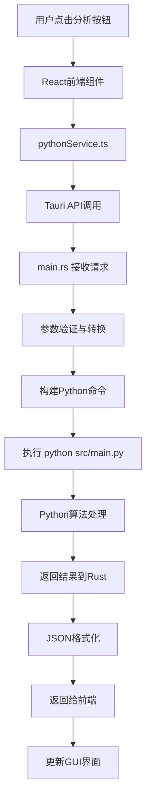

# FIFO资金追踪审计系统 - 完整架构说明

> **版本**: v2.0.0  
> **更新时间**: 2025年8月22日  
> **架构类型**: 渐进式现代化 (Progressive Modernization)

## 🏗️ 总体架构概览

```
┌─────────────────────────────────────────────────────────────────────┐
│                     FIFO资金追踪审计系统                              │
│                   (渐进式现代化架构)                                   │
└─────────────────────────────────────────────────────────────────────┘

┌─────────────────┐    ┌─────────────────┐    ┌─────────────────┐
│   用户界面层     │    │   系统衔接层     │    │   算法处理层     │
│   (Frontend)    │────│   (Bridge)      │────│   (Backend)     │
│                 │    │                 │    │                 │
│  React + TS     │    │  Tauri + Rust   │    │  Python + 算法   │
│  现代化GUI      │    │  接口适配器      │    │  核心业务逻辑    │
└─────────────────┘    └─────────────────┘    └─────────────────┘
```

## 📁 项目目录结构

```
audit/                                    # 项目根目录
├── 📱 tauri-app/                        # Tauri桌面应用
│   ├── 🎨 src/                          # React前端代码
│   │   ├── App.tsx                      # 主应用组件
│   │   ├── main.tsx                     # React入口
│   │   ├── components/                  # 可复用组件
│   │   │   ├── common/                  # 通用组件
│   │   │   └── layout/Layout.tsx        # 布局组件
│   │   ├── pages/                       # 页面组件
│   │   │   ├── HomePage.tsx            # 主页
│   │   │   ├── AuditPage.tsx           # 审计分析页
│   │   │   ├── TimePointQueryPage.tsx  # 时点查询页
│   │   │   └── SettingsPage.tsx        # 设置页
│   │   ├── services/                    # 前端服务
│   │   │   ├── fileService.ts          # 文件操作服务
│   │   │   └── pythonService.ts        # Python调用服务
│   │   ├── contexts/                    # React上下文
│   │   │   ├── AppStateContext.tsx     # 应用状态
│   │   │   ├── ThemeContext.tsx        # 主题管理
│   │   │   └── LanguageContext.tsx     # 多语言支持
│   │   └── utils/                       # 工具函数
│   │       ├── storageUtils.ts         # 本地存储
│   │       └── timeUtils.ts            # 时间处理
│   │
│   └── 🦀 src-tauri/                    # Rust后端代码
│       ├── src/main.rs                  # **接口适配器核心**
│       ├── Cargo.toml                   # Rust依赖配置
│       └── tauri.conf.json             # Tauri应用配置
│
├── 🐍 src/                              # Python核心算法
│   ├── main.py                          # **Python主程序入口**
│   ├── config.py                        # 全局配置
│   │
│   ├── 🧠 core/                         # 核心业务层
│   │   ├── interfaces/                  # 接口定义
│   │   │   └── tracker_interface.py    # 追踪器统一接口
│   │   ├── factories/                   # 工厂模式
│   │   │   └── tracker_factory.py      # 追踪器工厂
│   │   └── trackers/                    # 追踪器实现
│   │       ├── fifo_adapter.py         # FIFO适配器
│   │       └── balance_method_tracker.py # 差额计算法追踪器
│   │
│   ├── 🔍 models/                       # 算法模型层
│   │   ├── fifo_algorithm.py           # FIFO算法实现
│   │   ├── behavior_analyzer.py        # 行为分析器
│   │   ├── flow_analyzer.py            # 流量分析器
│   │   └── investment_manager.py       # 投资管理器
│   │
│   ├── 🔧 services/                     # 服务层
│   │   ├── audit_service.py            # 审计服务
│   │   ├── time_point_query_service.py # 时点查询服务
│   │   ├── query_cli.py                # 查询CLI接口
│   │   └── fund_pool_cli.py            # 资金池CLI接口
│   │
│   └── 🛠️ utils/                        # 工具层
│       ├── data_processor.py           # 数据处理器
│       ├── logger.py                   # 日志管理
│       ├── validators.py               # 数据验证
│       └── flow_integrity_validator.py # 流量完整性验证
│
└── 📄 docs/                             # 文档目录
    ├── README.md                        # 项目说明
    ├── QUICK_START.md                  # 快速开始
    └── PROJECT_ARCHITECTURE.md         # 原始架构文档
```

## 🔄 系统调用流程

### 1. GUI操作流程 (完整调用链)



### 2. 详细调用映射

#### **前端 → 后端调用**
```typescript
// 前端调用 (React)
await invoke("run_audit_analysis", {
    filePath: selectedFile,
    algorithm: "FIFO",
    outputPath: "output.xlsx"
});

// ↓ 转换为

// Rust接口 (main.rs)
#[tauri::command]
async fn run_audit_analysis(
    file_path: String,
    algorithm: String, 
    output_path: String
) -> Result<AuditResult, String>

// ↓ 转换为

// Python命令 (Shell执行)
python src/main.py --algorithm FIFO --input input.xlsx --output output.xlsx
```

#### **算法层调用链**
```python
# main.py (入口)
def main():
    service = AuditService()
    service.analyze(algorithm, input_file)

# ↓

# AuditService (服务层)
def analyze(self, algorithm: str, input_file: str):
    tracker = TrackerFactory.create_tracker(algorithm)
    tracker.process_data(data)

# ↓

# TrackerFactory (工厂层)
def create_tracker(algorithm: str):
    if algorithm == "FIFO":
        return FIFOTracker()  # 适配器
    elif algorithm == "BALANCE_METHOD":
        return BalanceMethodTracker()  # 直接实现

# ↓

# FIFOTracker (适配器层)
def process_data(self, data):
    return self._legacy_tracker.process_data(data)  # 委托调用

# ↓

# FIFO资金追踪器 (算法实现层)
def process_data(self, data):
    # 实际的FIFO算法逻辑
    return fifo_result
```

## 🎯 核心组件详解

### 1. **main.rs - 接口适配器核心**

**位置**: `tauri-app/src-tauri/src/main.rs`  
**作用**: GUI与Python CLI的适配桥梁

```rust
// 核心功能
#[tauri::command]
async fn run_audit_analysis(...) -> Result<AuditResult, String> {
    // 1. 参数验证
    // 2. 构建Python命令
    // 3. 异步执行Python进程
    // 4. 实时进度反馈
    // 5. 结果解析与返回
}

#[tauri::command] 
async fn query_time_point(...) -> Result<QueryResult, String> {
    // 时点查询功能适配
}

#[tauri::command]
async fn query_fund_pool_details(...) -> Result<PoolDetails, String> {
    // 资金池查询功能适配
}
```

**关键特性**:
- ✅ 异步执行，GUI不阻塞
- ✅ 实时进度反馈 
- ✅ 错误处理与转换
- ✅ 跨平台兼容性

### 2. **main.py - Python主程序入口**

**位置**: `src/main.py`  
**作用**: 命令行接口，协调各服务层

```python
def main():
    parser = argparse.ArgumentParser()
    parser.add_argument("--algorithm", choices=["FIFO", "BALANCE_METHOD"])
    parser.add_argument("--input", required=True)
    parser.add_argument("--output")
    parser.add_argument("--compare", action="store_true")
    
    args = parser.parse_args()
    
    # 创建审计服务
    service = AuditService()
    
    if args.compare:
        service.compare_algorithms(args.input)
    else:
        service.analyze(args.algorithm, args.input, args.output)
```

**支持的操作**:
- ✅ 单算法分析 (`--algorithm FIFO`)
- ✅ 算法对比 (`--compare`)
- ✅ 自定义输出 (`--output`)
- ✅ 算法列表 (`--list-algorithms`)

### 3. **追踪器架构 - 适配器模式**

#### **统一接口** (`tracker_interface.py`)
```python
class ITracker:
    def 初始化余额(self, 初始余额: float, 余额类型: str) -> None: ...
    def 处理资金流入(self, 金额: float, 资金属性: str, 交易日期) -> Tuple[float, float, str]: ...
    def 处理资金流出(self, 金额: float, 资金属性: str, 交易日期) -> Tuple[float, float, str]: ...
    def 获取状态摘要(self) -> Dict[str, Any]: ...
```

#### **FIFO适配器** (`fifo_adapter.py`)
```python
class FIFOTracker(ITracker):
    def __init__(self):
        # 包装原有实现
        self._legacy_tracker = LegacyFIFOTracker()
    
    def 处理资金流入(self, ...):
        # 直接委托调用
        return self._legacy_tracker.处理资金流入(...)
```

#### **差额计算法追踪器** (`balance_method_tracker.py`)
```python
class BalanceMethodTracker(ITracker):
    def __init__(self):
        # 直接实现，复用工具类
        self._行为分析器 = BehaviorAnalyzer()
    
    def 处理资金流出(self, ...):
        # 差额计算法核心逻辑
        个人扣除 = min(金额, self._个人余额)
        公司扣除 = min(剩余金额, self._公司余额)
        # ...
```

## 🌊 数据流向图

```
┌─────────────────┐    JSON请求    ┌─────────────────┐    Shell命令   ┌─────────────────┐
│   React前端     │───────────────→│   Tauri Rust   │───────────────→│   Python后端    │
│                 │                │                 │                │                 │
│ • 文件选择      │                │ • 参数验证      │                │ • 算法执行      │
│ • 参数配置      │                │ • 命令构建      │                │ • Excel处理     │
│ • 进度显示      │                │ • 进程管理      │                │ • 结果生成      │
│ • 结果展示      │                │ • 错误处理      │                │                 │
│                 │    JSON响应    │                 │    文本输出    │                 │
│                 │←───────────────│                 │←───────────────│                 │
└─────────────────┘                └─────────────────┘                └─────────────────┘
        ↑                                   ↑                                   ↓
        │                                   │                          ┌─────────────────┐
        │                                   │                          │   Excel输出     │
        │                                   │                          │                 │
        │                           ┌─────────────────┐               │ • 资金追踪结果  │
        │                           │   文件系统      │               │ • 场外资金池    │
        │                           │                 │               │ • 交易记录      │
        │                           │ • Excel读取     │               │                 │
        └───────────────────────────│ • 结果存储      │←──────────────│                 │
                                    │ • 日志记录      │               └─────────────────┘
                                    └─────────────────┘
```

## 🔗 关键接口定义

### 1. **Tauri接口** (Rust ↔ TypeScript)

```typescript
// TypeScript接口定义
export interface AuditRequest {
    filePath: string;
    algorithm: "FIFO" | "BALANCE_METHOD";
    outputPath?: string;
}

export interface AuditResult {
    success: boolean;
    outputPath: string;
    summary: {
        个人余额: number;
        公司余额: number;
        累计挪用金额: number;
        累计垫付金额: number;
        资金缺口: number;
    };
    message?: string;
}
```

```rust
// Rust接口定义
#[derive(Debug, Serialize, Deserialize)]
pub struct AuditRequest {
    pub file_path: String,
    pub algorithm: String,
    pub output_path: Option<String>,
}

#[derive(Debug, Serialize, Deserialize)]
pub struct AuditResult {
    pub success: bool,
    pub output_path: String,
    pub summary: AuditSummary,
    pub message: Option<String>,
}
```

### 2. **Python CLI接口**

```bash
# 基本分析
python src/main.py --algorithm FIFO --input data.xlsx

# 算法对比
python src/main.py --compare --input data.xlsx

# 时点查询
python src/services/query_cli.py --file data.xlsx --row 100 --algorithm FIFO

# 资金池查询
python src/services/fund_pool_cli.py --file data.xlsx --row 50 --algorithm FIFO --pool "产品A"
```

## 🏛️ 架构设计原则

### 1. **渐进式现代化**
- 🔄 保留Python核心算法逻辑
- 🎨 现代化用户界面 (React)
- 🌉 最小化接口适配层 (Rust)

### 2. **适配器模式应用**
- 🔌 **GUI适配器**: main.rs (Web API ↔ CLI)
- 🔌 **算法适配器**: fifo_adapter.py (统一接口 ↔ 原始实现)
- 🔌 **接口适配器**: tracker_interface.py (标准化接口)

### 3. **分层架构**
```
┌─────────────────┐ 
│   表现层        │  React前端 + Tauri界面
├─────────────────┤
│   适配层        │  Rust接口适配 + Python适配器
├─────────────────┤  
│   服务层        │  AuditService + QueryService
├─────────────────┤
│   业务层        │  Tracker工厂 + 算法实现
├─────────────────┤
│   数据层        │  Excel处理 + 配置管理
└─────────────────┘
```

### 4. **职责分离**
- **React**: 负责用户交互和界面展示
- **Rust**: 负责系统调用和进程管理  
- **Python**: 负责业务逻辑和算法计算

## 🚀 部署和运行

### 1. **开发环境运行**
```bash
# 启动Tauri开发服务器
cd tauri-app
npm run tauri dev

# 或直接运行Python CLI
python src/main.py --algorithm FIFO --input test.xlsx
```

### 2. **生产环境构建**
```bash
# 构建Tauri应用
cd tauri-app  
npm run tauri build

# 构建独立Python可执行文件
cd tauri-app/scripts
./build_standalone.ps1
```

### 3. **文件结构说明**
- **开发**: 源码形式，支持热重载
- **生产**: 单一可执行文件，包含所有依赖

## 📊 性能特性

### 1. **异步处理**
- ✅ GUI界面始终响应
- ✅ 实时进度反馈
- ✅ 可取消长时间操作

### 2. **内存管理**  
- ✅ Rust自动内存管理
- ✅ Python进程隔离
- ✅ 大文件流式处理

### 3. **跨平台支持**
- ✅ Windows (主要目标)
- ✅ macOS  
- ✅ Linux

## 🔧 扩展性设计

### 1. **新算法添加**
```python
# 1. 实现ITracker接口
class NewAlgorithmTracker(ITracker):
    def 处理资金流出(self, ...): ...

# 2. 在工厂中注册
TrackerFactory.SUPPORTED_ALGORITHMS["NEW_ALG"] = "新算法"
```

### 2. **新功能添加**
```rust
// 1. 添加Tauri命令
#[tauri::command]
async fn new_feature(...) -> Result<..., String> { ... }

// 2. 前端调用
await invoke("new_feature", { ... });
```

### 3. **新界面添加**
```typescript
// 1. 创建新页面组件
export const NewPage: React.FC = () => { ... };

// 2. 添加路由
<Route path="/new" component={NewPage} />
```

---

## 📝 总结

这是一个精心设计的**渐进式现代化架构**，通过多层适配器模式，成功地将传统Python CLI应用转换为现代桌面应用，同时保持了原有业务逻辑的稳定性和可靠性。

**核心优势**:
- 🎯 **用户体验**: 现代化GUI界面
- 🔄 **技术延续**: 保留现有Python算法  
- 🚀 **性能优异**: Rust提供高性能系统调用
- 🔧 **易于维护**: 清晰的分层和适配器模式
- 📈 **可扩展性**: 支持新算法和功能的无缝添加