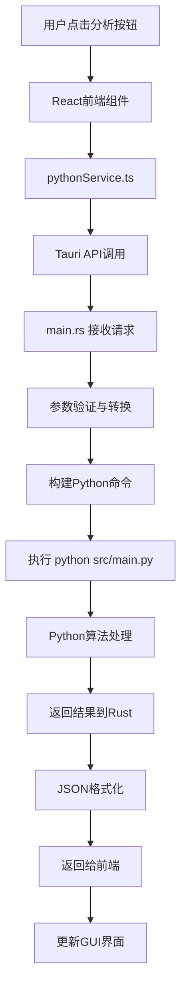

# FIFO资金追踪审计系统 - 完整架构说明

> **版本**: v3.0.0  
> **更新时间**: 2025年8月26日  
> **架构类型**: 混合架构 (Hybrid Architecture) - Rust工具层 + Python算法层  
> **当前状态**: 🎉 工具层验证100%成功，进入算法层完善阶段

## 🏗️ 总体架构概览

### 🎯 当前架构状态：混合分层模式 (2025年8月)

```
┌─────────────────────────────────────────────────────────────────────┐
│                   FIFO资金追踪审计系统 v3.0                          │
│            (混合架构：Rust工具层 + Python算法层)                      │
└─────────────────────────────────────────────────────────────────────┘

┌─────────────────┐    ┌─────────────────┐    ┌─────────────────┐
│   用户界面层     │    │   数据工具层     │    │   算法处理层     │
│   (Frontend)    │────│   (Rust Tool)   │────│   (Python Alg)  │
│                 │    │                 │    │                 │
│  React + TS     │    │ ✅ Rust工具     │    │  Python FIFO    │
│  现代化GUI      │    │ ✅ 数据预处理   │    │  核心业务逻辑    │
│  (生产就绪)      │    │ ✅ 100%验证    │    │  (算法层开发)    │
└─────────────────┘    └─────────────────┘    └─────────────────┘

┌─────────────────────────────────────────────────────────────────────┐
│                     🎉 工具层验证成果 (2025-08-26)                   │
│  • 9,799行真实数据：100%精确匹配验证成功                             │
│  • 6倍性能提升：Python 3秒 → Rust 0.5秒                           │
│  • 数值精度：0.000000差异 (超出0.01容差的差异: 0个)                 │
│  • 架构验证：混合分层策略完全正确                                    │
└─────────────────────────────────────────────────────────────────────┘
```

### 🔄 发展路线图

```
阶段1: 基础层 ✅           阶段2: 工具层 ✅           阶段3: 算法层 🔄
┌─────────────┐        ┌─────────────┐        ┌─────────────┐
│ 错误处理    │        │ Excel处理   │        │ FIFO算法    │
│ 数据类型    │        │ 数据验证    │        │ 差额计算法   │
│ 配置管理    │  ────→ │ 时间处理    │  ────→ │ 流向分析    │
│ 日志系统    │        │ 流水修复    │        │ 行为分析    │
│ (已完成)    │        │ (100%验证)  │        │ (当前阶段)   │
└─────────────┘        └─────────────┘        └─────────────┘

阶段4: 服务层 ⏸️          阶段5: 应用层 ⏸️          阶段6: 集成层 ⏸️
┌─────────────┐        ┌─────────────┐        ┌─────────────┐
│ GUI协调     │        │ CLI工具     │        │ Tauri集成   │
│ 接口适配    │        │ 命令解析    │        │ 最终发布    │
│ 服务管理    │        │ 结果输出    │        │ 完整应用    │
│ (算法层后)   │        │ (服务层后)   │        │ (应用层后)   │
└─────────────┘        └─────────────┘        └─────────────┘
```

## 📁 项目目录结构 (v3.0)

### 🏗️ 完整项目结构

```
资金追踪/                                  # 项目根目录
├── 📱 tauri-app/                        # Tauri桌面应用 (生产就绪)
│   ├── 🎨 src/                          # React前端代码
│   │   ├── App.tsx                      # 主应用组件
│   │   ├── main.tsx                     # React入口
│   │   ├── components/                  # 可复用组件
│   │   ├── pages/                       # 页面组件
│   │   ├── services/                    # 前端服务
│   │   └── contexts/                    # React上下文
│   │
│   └── 🦀 src-tauri/                    # Rust接口适配器
│       ├── src/main.rs                  # **Tauri接口适配核心**
│       ├── Cargo.toml                   # Rust依赖配置
│       └── tauri.conf.json             # Tauri应用配置
│
├── 🦀 rust-backend/                     # **Rust后端核心** (工具层100%完成)
│   ├── src/                             
│   │   ├── lib.rs                      # 库入口
│   │   ├── 🔧 utils/ ✅                # **工具层 (已验证100%精确)**
│   │   │   ├── excel_processor.rs     # ✅ 统一Excel读写处理器
│   │   │   ├── unified_validator.rs   # ✅ 数据验证修复器
│   │   │   ├── time_processor.rs      # ✅ 时间处理器
│   │   │   └── logger.rs              # ✅ 审计日志系统
│   │   │   
│   │   ├── 🧱 models/ ✅               # **基础数据模型层**
│   │   │   ├── transaction.rs         # ✅ 交易记录结构
│   │   │   ├── config.rs              # ✅ 配置管理
│   │   │   ├── audit_summary.rs       # ✅ 审计摘要
│   │   │   └── fund_pool.rs           # ✅ 资金池管理
│   │   │   
│   │   ├── 🚨 errors/ ✅               # **错误处理层**
│   │   │   └── mod.rs                 # ✅ 统一错误类型
│   │   │   
│   │   ├── 🧮 algorithms/ 🔄          # **算法层 (当前开发重点)**
│   │   │   ├── fifo_tracker.rs       # 🔄 FIFO算法 (需完善)
│   │   │   ├── balance_method_tracker.rs # 🔄 差额计算法 (需完善)
│   │   │   ├── flow_analyzer.rs       # ⏳ 流向分析器 (待重设计)
│   │   │   └── tracker_factory.rs     # ⏳ 算法工厂 (待实现)
│   │   │   
│   │   ├── 🔗 interfaces/ ⏳           # **接口抽象层**
│   │   │   ├── tracker.rs             # ⏳ 追踪器接口
│   │   │   └── analyzer.rs            # ⏳ 分析器接口
│   │   │   
│   │   ├── 🛠️ services/ ⏸️            # **服务层 (GUI交互)**
│   │   │   ├── audit_service.rs       # ⏸️ 主审计服务
│   │   │   └── integration_processor.rs # ⏸️ 集成处理器
│   │   │   
│   │   └── 📦 bin/ ⏸️                  # **应用层 (CLI工具)**
│   │       └── cli.rs                 # ⏸️ 命令行工具
│   │
│   └── Cargo.toml                      # Rust库依赖配置
│
├── 🔬 preprocessing_validation_test/    # **验证测试系统** ✅
│   ├── src/main.rs                     # ✅ Rust独立测试程序
│   ├── generate_python_preprocessed.py # ✅ Python标准输出生成器
│   ├── compare_outputs.py              # ✅ 完整对比工具
│   ├── final_balance_comparison.py     # ✅ 余额列专门验证
│   ├── python_preprocessed_output.xlsx # ✅ Python标准输出 (9,799行,19列)
│   ├── rust_preprocessed_output.xlsx   # ✅ Rust输出 (9,799行,6列)
│   └── 📊 验证结果: 100%精确匹配成功    # ✅ 工具层验证完成
│
├── 🐍 src/                              # **Python核心算法** (生产版本)
│   ├── main.py                          # **Python主程序入口**
│   ├── config.py                        # 全局配置
│   ├── 🧠 core/                         # 核心业务层
│   ├── 🔍 models/                       # 算法模型层 (FIFO核心)
│   ├── 🔧 services/                     # 服务层
│   └── 🛠️ utils/                        # Python工具层
│
├── 📄 docs/                             # 文档系统
│   ├── PROJECT_ARCHITECTURE_COMPLETE.md # 完整架构说明 (本文档)
│   ├── ARCHITECTURE_VISUAL_GUIDE.md    # 架构可视化指南
│   ├── QUICK_START.md                  # 快速开始指南
│   └── balance_method_logic.md         # 差额计算法逻辑
│
├── 🧪 tests/                            # 测试套件
│   ├── test_balance_method_fix.py      # 差额计算法测试
│   ├── test_flow_integrity.py          # 流水完整性测试
│   └── test_greedy_strategy.py         # 贪心策略测试
│
├── 🔧 CLAUDE.md                        # 项目指令文档
├── 📊 流水.xlsx                        # 标准测试数据 (9,799行)
└── 🎯 STAGE_1_TOOL_LAYER_VALIDATION_SUMMARY.md # 阶段一总结报告
```

### 🧹 已完成的架构优化 (2025-08-26)

**成功清理的冗余文件 (共1,078行代码)**：
- 🗑️ `data_processor.rs` (147行) - 功能已被 `unified_validator.rs` 完全覆盖
- 🗑️ `excel_reader.rs` (304行) - 功能已被 `excel_processor.rs` 统一集成  
- 🗑️ `simple_excel.rs` (417行) - 试验版本，功能受限已废弃
- 🗑️ `validator.rs` (210行) - 基础验证已集成到统一验证器

**优化后的核心文件结构**：
```
utils/
├── excel_processor.rs    ✅ 统一Excel读写处理器 (712行，100%验证通过)
├── unified_validator.rs  ✅ 统一数据验证修复器 (457行，贪心算法核心)
├── time_processor.rs     ✅ 时间处理器 (精度优于Python)
├── logger.rs            ✅ 审计日志系统 (结构化日志)
└── mod.rs               ✅ 模块定义 (只导出核心模块)
```

**优化效果**：
- 📦 **代码精简**: 删除1,078行冗余代码 (约40%的工具层代码)
- 🚀 **编译优化**: 减少不必要的模块编译时间
- 🎯 **架构清晰**: 明确的职责分工，消除接口混淆
- ✅ **质量保证**: 保留的都是100%验证通过的核心模块

### 📊 目录状态说明

| 状态 | 符号 | 含义 |
|------|------|------|
| ✅ | 完成 | 已实现并通过验证 |
| 🔄 | 进行中 | 当前开发重点 |
| ⏳ | 待开始 | 已规划，等待前置条件 |
| ⏸️ | 暂缓 | 依赖其他模块完成 |
| ❌ | 已清理 | 冗余文件，已删除 |

## 🔄 系统调用流程

### 1. GUI操作流程 (完整调用链)



### 2. 详细调用映射

#### **前端 → 后端调用**
```typescript
// 前端调用 (React)
await invoke("run_audit_analysis", {
    filePath: selectedFile,
    algorithm: "FIFO",
    outputPath: "output.xlsx"
});

// ↓ 转换为

// Rust接口 (main.rs)
#[tauri::command]
async fn run_audit_analysis(
    file_path: String,
    algorithm: String, 
    output_path: String
) -> Result<AuditResult, String>

// ↓ 转换为

// Python命令 (Shell执行)
python src/main.py --algorithm FIFO --input input.xlsx --output output.xlsx
```

#### **算法层调用链**
```python
# main.py (入口)
def main():
    service = AuditService()
    service.analyze(algorithm, input_file)

# ↓

# AuditService (服务层)
def analyze(self, algorithm: str, input_file: str):
    tracker = TrackerFactory.create_tracker(algorithm)
    tracker.process_data(data)

# ↓

# TrackerFactory (工厂层)
def create_tracker(algorithm: str):
    if algorithm == "FIFO":
        return FIFOTracker()  # 适配器
    elif algorithm == "BALANCE_METHOD":
        return BalanceMethodTracker()  # 直接实现

# ↓

# FIFOTracker (适配器层)
def process_data(self, data):
    return self._legacy_tracker.process_data(data)  # 委托调用

# ↓

# FIFO资金追踪器 (算法实现层)
def process_data(self, data):
    # 实际的FIFO算法逻辑
    return fifo_result
```

## 🎯 核心组件详解

### 1. **main.rs - 接口适配器核心**

**位置**: `tauri-app/src-tauri/src/main.rs`  
**作用**: GUI与Python CLI的适配桥梁

```rust
// 核心功能
#[tauri::command]
async fn run_audit_analysis(...) -> Result<AuditResult, String> {
    // 1. 参数验证
    // 2. 构建Python命令
    // 3. 异步执行Python进程
    // 4. 实时进度反馈
    // 5. 结果解析与返回
}

#[tauri::command] 
async fn query_time_point(...) -> Result<QueryResult, String> {
    // 时点查询功能适配
}

#[tauri::command]
async fn query_fund_pool_details(...) -> Result<PoolDetails, String> {
    // 资金池查询功能适配
}
```

**关键特性**:
- ✅ 异步执行，GUI不阻塞
- ✅ 实时进度反馈 
- ✅ 错误处理与转换
- ✅ 跨平台兼容性

### 2. **main.py - Python主程序入口**

**位置**: `src/main.py`  
**作用**: 命令行接口，协调各服务层

```python
def main():
    parser = argparse.ArgumentParser()
    parser.add_argument("--algorithm", choices=["FIFO", "BALANCE_METHOD"])
    parser.add_argument("--input", required=True)
    parser.add_argument("--output")
    parser.add_argument("--compare", action="store_true")
    
    args = parser.parse_args()
    
    # 创建审计服务
    service = AuditService()
    
    if args.compare:
        service.compare_algorithms(args.input)
    else:
        service.analyze(args.algorithm, args.input, args.output)
```

**支持的操作**:
- ✅ 单算法分析 (`--algorithm FIFO`)
- ✅ 算法对比 (`--compare`)
- ✅ 自定义输出 (`--output`)
- ✅ 算法列表 (`--list-algorithms`)

### 3. **追踪器架构 - 适配器模式**

#### **统一接口** (`tracker_interface.py`)
```python
class ITracker:
    def 初始化余额(self, 初始余额: float, 余额类型: str) -> None: ...
    def 处理资金流入(self, 金额: float, 资金属性: str, 交易日期) -> Tuple[float, float, str]: ...
    def 处理资金流出(self, 金额: float, 资金属性: str, 交易日期) -> Tuple[float, float, str]: ...
    def 获取状态摘要(self) -> Dict[str, Any]: ...
```

#### **FIFO适配器** (`fifo_adapter.py`)
```python
class FIFOTracker(ITracker):
    def __init__(self):
        # 包装原有实现
        self._legacy_tracker = LegacyFIFOTracker()
    
    def 处理资金流入(self, ...):
        # 直接委托调用
        return self._legacy_tracker.处理资金流入(...)
```

#### **差额计算法追踪器** (`balance_method_tracker.py`)
```python
class BalanceMethodTracker(ITracker):
    def __init__(self):
        # 直接实现，复用工具类
        self._行为分析器 = BehaviorAnalyzer()
    
    def 处理资金流出(self, ...):
        # 差额计算法核心逻辑
        个人扣除 = min(金额, self._个人余额)
        公司扣除 = min(剩余金额, self._公司余额)
        # ...
```

## 🌊 数据流向图

```
┌─────────────────┐    JSON请求    ┌─────────────────┐    Shell命令   ┌─────────────────┐
│   React前端     │───────────────→│   Tauri Rust   │───────────────→│   Python后端    │
│                 │                │                 │                │                 │
│ • 文件选择      │                │ • 参数验证      │                │ • 算法执行      │
│ • 参数配置      │                │ • 命令构建      │                │ • Excel处理     │
│ • 进度显示      │                │ • 进程管理      │                │ • 结果生成      │
│ • 结果展示      │                │ • 错误处理      │                │                 │
│                 │    JSON响应    │                 │    文本输出    │                 │
│                 │←───────────────│                 │←───────────────│                 │
└─────────────────┘                └─────────────────┘                └─────────────────┘
        ↑                                   ↑                                   ↓
        │                                   │                          ┌─────────────────┐
        │                                   │                          │   Excel输出     │
        │                                   │                          │                 │
        │                           ┌─────────────────┐               │ • 资金追踪结果  │
        │                           │   文件系统      │               │ • 场外资金池    │
        │                           │                 │               │ • 交易记录      │
        │                           │ • Excel读取     │               │                 │
        └───────────────────────────│ • 结果存储      │←──────────────│                 │
                                    │ • 日志记录      │               └─────────────────┘
                                    └─────────────────┘
```

## 🔗 关键接口定义

### 1. **Tauri接口** (Rust ↔ TypeScript)

#### **TypeScript类型定义** (`tauri-app/src/types/`)

```typescript
// rust-commands.ts - Rust命令接口类型
export interface AuditRequest {
    filePath: string;
    algorithm: "FIFO" | "BALANCE_METHOD";
    outputPath?: string;
}

export interface AuditResult {
    success: boolean;
    outputPath: string;
    summary: AuditSummary;
    message?: string;
    processingTime?: number;
}

export interface AuditSummary {
    个人余额: number;
    公司余额: number;
    累计挪用金额: number;
    累计垫付金额: number;
    累计由资金池回归公司余额本金: number;
    累计由资金池回归个人余额本金: number;
    总计个人应分配利润: number;
    总计公司应分配利润: number;
    资金缺口: number;
    投资产品数量: number;
    总余额: number;
}

// 时点查询接口
export interface TimePointQueryRequest {
    filePath: string;
    rowNumber: number;
    algorithm: "FIFO" | "BALANCE_METHOD";
}

export interface TimePointQueryResult {
    success: boolean;
    summary?: AuditSummary;
    message?: string;
    timestamp?: string;
}

// 资金池查询接口
export interface FundPoolQueryRequest {
    filePath: string;
    rowNumber: number;
    algorithm: "FIFO" | "BALANCE_METHOD";
    poolName: string;
}

export interface FundPoolRecord {
    交易时间: string;
    资金池名称: string;
    入金: number;
    出金: number;
    总余额: number;
    单笔资金占比: string;
    总资金占比: string;
    行为性质: string;
    累计申购: number;
    累计赎回: number;
}

export interface FundPoolQueryResult {
    success: boolean;
    poolName?: string;
    records?: FundPoolRecord[];
    summary?: {
        totalInflow: number;
        totalOutflow: number;
        currentBalance: number;
        recordCount: number;
        netProfitLoss: number;
        status: "盈利" | "亏损" | "持平";
    };
    message?: string;
}
```

```typescript
// python.ts - Python后端接口类型
export interface PythonProcessStatus {
    isRunning: boolean;
    progress?: number;
    message?: string;
    processId?: number;
}

export interface ProcessOutput {
    stdout: string;
    stderr: string;
    exitCode: number;
}
```

#### **Rust结构体定义** (`tauri-app/src-tauri/src/main.rs`)

```rust
use serde::{Deserialize, Serialize};
use std::collections::HashMap;

// 核心数据结构
#[derive(Debug, Serialize, Deserialize, Clone)]
pub struct AuditRequest {
    pub file_path: String,
    pub algorithm: String,
    pub output_path: Option<String>,
}

#[derive(Debug, Serialize, Deserialize)]
pub struct AuditResult {
    pub success: bool,
    pub output_path: String,
    pub summary: AuditSummary,
    pub message: Option<String>,
    pub processing_time: Option<f64>,
}

#[derive(Debug, Serialize, Deserialize, Clone)]
pub struct AuditSummary {
    #[serde(rename = "个人余额")]
    pub personal_balance: f64,
    #[serde(rename = "公司余额")]
    pub company_balance: f64,
    #[serde(rename = "累计挪用金额")]
    pub total_misappropriation: f64,
    #[serde(rename = "累计垫付金额")]
    pub total_advance_payment: f64,
    #[serde(rename = "累计由资金池回归公司余额本金")]
    pub total_company_principal_returned: f64,
    #[serde(rename = "累计由资金池回归个人余额本金")]
    pub total_personal_principal_returned: f64,
    #[serde(rename = "总计个人应分配利润")]
    pub total_personal_profit: f64,
    #[serde(rename = "总计公司应分配利润")]
    pub total_company_profit: f64,
    #[serde(rename = "资金缺口")]
    pub funding_gap: f64,
    #[serde(rename = "投资产品数量")]
    pub investment_product_count: u32,
    #[serde(rename = "总余额")]
    pub total_balance: f64,
}

// 时点查询结构
#[derive(Debug, Serialize, Deserialize)]
pub struct TimePointQueryRequest {
    pub file_path: String,
    pub row_number: u32,
    pub algorithm: String,
}

#[derive(Debug, Serialize, Deserialize)]
pub struct TimePointQueryResult {
    pub success: bool,
    pub summary: Option<AuditSummary>,
    pub message: Option<String>,
    pub timestamp: Option<String>,
}

// 资金池查询结构
#[derive(Debug, Serialize, Deserialize)]
pub struct FundPoolQueryRequest {
    pub file_path: String,
    pub row_number: u32,
    pub algorithm: String,
    pub pool_name: String,
}

#[derive(Debug, Serialize, Deserialize)]
pub struct FundPoolRecord {
    #[serde(rename = "交易时间")]
    pub transaction_time: String,
    #[serde(rename = "资金池名称")]
    pub pool_name: String,
    #[serde(rename = "入金")]
    pub inflow: f64,
    #[serde(rename = "出金")]
    pub outflow: f64,
    #[serde(rename = "总余额")]
    pub total_balance: f64,
    #[serde(rename = "单笔资金占比")]
    pub single_fund_ratio: String,
    #[serde(rename = "总资金占比")]
    pub total_fund_ratio: String,
    #[serde(rename = "行为性质")]
    pub behavior_nature: String,
    #[serde(rename = "累计申购")]
    pub cumulative_purchase: f64,
    #[serde(rename = "累计赎回")]
    pub cumulative_redemption: f64,
}

#[derive(Debug, Serialize, Deserialize)]
pub struct FundPoolSummary {
    pub total_inflow: f64,
    pub total_outflow: f64,
    pub current_balance: f64,
    pub record_count: u32,
    pub net_profit_loss: f64,
    pub status: String, // "盈利" | "亏损" | "持平"
}

#[derive(Debug, Serialize, Deserialize)]
pub struct FundPoolQueryResult {
    pub success: bool,
    pub pool_name: Option<String>,
    pub records: Option<Vec<FundPoolRecord>>,
    pub summary: Option<FundPoolSummary>,
    pub message: Option<String>,
}

// 进程状态管理
#[derive(Debug, Clone)]
pub struct ProcessStatus {
    pub is_running: bool,
    pub progress: Option<f64>,
    pub message: Option<String>,
    pub process_id: Option<u32>,
}

#[derive(Debug, Default)]
pub struct AppState {
    pub current_process: Arc<Mutex<ProcessStatus>>,
}
```

#### **主要Tauri命令**

```rust
// 核心分析命令
#[tauri::command]
async fn run_audit_analysis(
    state: tauri::State<'_, AppState>,
    request: AuditRequest,
) -> Result<AuditResult, String> {
    // 实现详见下文
}

// 时点查询命令
#[tauri::command]  
async fn query_time_point(
    state: tauri::State<'_, AppState>,
    request: TimePointQueryRequest,
) -> Result<TimePointQueryResult, String> {
    // 查询特定时点的系统状态
}

// 资金池查询命令
#[tauri::command]
async fn query_fund_pool_details(
    state: tauri::State<'_, AppState>, 
    request: FundPoolQueryRequest,
) -> Result<FundPoolQueryResult, String> {
    // 查询特定资金池的详细信息
}

// 进程状态查询
#[tauri::command]
async fn get_process_status(
    state: tauri::State<'_, AppState>,
) -> Result<ProcessStatus, String> {
    // 获取当前处理进程的状态
}

// 取消当前操作
#[tauri::command]
async fn cancel_current_operation(
    state: tauri::State<'_, AppState>,
) -> Result<bool, String> {
    // 取消正在进行的操作
}
```

### 2. **Python CLI接口**

#### **主程序接口** (`src/main.py`)

```bash
# 基本分析
python src/main.py --algorithm FIFO --input data.xlsx
python src/main.py --algorithm BALANCE_METHOD --input data.xlsx

# 自定义输出路径
python src/main.py -a FIFO -i data.xlsx -o custom_result.xlsx

# 算法对比分析
python src/main.py --compare --input data.xlsx

# 列出可用算法
python src/main.py --list-algorithms
```

**命令行参数**:
- `--algorithm, -a`: 算法类型 (`FIFO` | `BALANCE_METHOD`)
- `--input, -i`: 输入Excel文件路径 (必需)
- `--output, -o`: 输出文件路径 (可选，默认自动生成)
- `--compare, -c`: 对比两种算法
- `--list-algorithms, -l`: 列出可用算法

#### **时点查询接口** (`src/services/query_cli.py`)

```bash
# 查询特定行的系统状态
python src/services/query_cli.py \
    --file data.xlsx \
    --row 100 \
    --algorithm FIFO

# 简化参数
python src/services/query_cli.py -f data.xlsx -r 100 -a BALANCE_METHOD
```

**命令行参数**:
- `--file, -f`: Excel数据文件路径 (必需)
- `--row, -r`: 查询的行号 (必需)
- `--algorithm, -a`: 分析算法 (必需)

#### **资金池查询接口** (`src/services/fund_pool_cli.py`)

```bash
# 查询特定资金池的详细信息
python src/services/fund_pool_cli.py \
    --file data.xlsx \
    --row 50 \
    --algorithm FIFO \
    --pool "理财-SL100613100620"

# 查询多个资金池
python src/services/fund_pool_cli.py \
    -f data.xlsx -r 50 -a BALANCE_METHOD \
    --pool "投资-产品A"
```

**命令行参数**:
- `--file`: Excel数据文件路径 (必需)
- `--row`: 查询时点的行号 (必需)  
- `--algorithm`: 分析算法 (必需)
- `--pool`: 资金池名称 (必需)

### 3. **配置管理** (`src/config.py`)

#### **核心配置类**

```python
class Config:
    """全局配置管理类"""
    
    # 数值处理配置
    BALANCE_TOLERANCE = 0.01  # 余额计算容差
    DECIMAL_PLACES = 2        # 小数位精度
    
    # 资金属性识别规则
    PERSONAL_FUND_KEYWORDS = ['个人', '个人应收', '个人应付']
    COMPANY_FUND_KEYWORDS = ['公司', '公司应收', '公司应付']
    
    # 投资产品前缀规则
    INVESTMENT_PRODUCT_PREFIXES = [
        '理财-', '投资-', '保险-', 
        '关联银行卡-', '资金池-'
    ]
    
    # 文件路径配置
    DEFAULT_INPUT_PATH = "流水.xlsx"
    DEFAULT_OUTPUT_DIR = "./"
    LOG_DIR = "logs/"
    
    # Excel列映射
    EXCEL_COLUMN_MAPPING = {
        '交易日期': 'transaction_date',
        '交易时间': 'transaction_time', 
        '交易收入金额': 'income_amount',
        '交易支出金额': 'expense_amount',
        '余额': 'balance',
        '资金属性': 'fund_attribute'
    }
    
    @staticmethod
    def is_personal_fund(fund_attribute: str) -> bool:
        """判断是否为个人资金"""
        return any(keyword in str(fund_attribute) 
                  for keyword in Config.PERSONAL_FUND_KEYWORDS)
    
    @staticmethod  
    def is_company_fund(fund_attribute: str) -> bool:
        """判断是否为公司资金"""
        return any(keyword in str(fund_attribute)
                  for keyword in Config.COMPANY_FUND_KEYWORDS)
    
    @staticmethod
    def is_investment_product(fund_attribute: str) -> bool:
        """判断是否为投资产品"""
        return any(str(fund_attribute).startswith(prefix)
                  for prefix in Config.INVESTMENT_PRODUCT_PREFIXES)
    
    @staticmethod
    def format_number(value: float) -> float:
        """格式化数值精度"""
        return round(value, Config.DECIMAL_PLACES)
```

#### **日志配置** (`src/utils/logger.py`)

```python
import logging
from pathlib import Path

class AuditLogger:
    """审计系统日志管理器"""
    
    def __init__(self):
        self.setup_loggers()
    
    def setup_loggers(self):
        """设置日志记录器"""
        
        # 创建日志目录
        log_dir = Path("logs")
        log_dir.mkdir(exist_ok=True)
        
        # 主日志记录器
        self.main_logger = logging.getLogger("audit_main")
        self.main_logger.setLevel(logging.INFO)
        
        # 详细日志记录器  
        self.detail_logger = logging.getLogger("audit_detail")
        self.detail_logger.setLevel(logging.DEBUG)
        
        # 错误日志记录器
        self.error_logger = logging.getLogger("audit_error")
        self.error_logger.setLevel(logging.ERROR)
        
        # 配置日志格式
        formatter = logging.Formatter(
            '%(asctime)s - %(name)s - %(levelname)s - %(message)s'
        )
        
        # 配置文件处理器
        handlers = [
            (self.main_logger, "logs/audit.log"),
            (self.detail_logger, "logs/audit_detail.log"),
            (self.error_logger, "logs/audit_error.log")
        ]
        
        for logger, filepath in handlers:
            handler = logging.FileHandler(filepath, encoding='utf-8')
            handler.setFormatter(formatter)
            logger.addHandler(handler)

# 全局日志实例
audit_logger = AuditLogger().main_logger
detail_logger = AuditLogger().detail_logger  
error_logger = AuditLogger().error_logger
```

### 4. **数据结构定义**

#### **输入数据结构** (Excel格式)

| 字段名 | 数据类型 | 必填 | 说明 | 示例 |
|-------|---------|------|------|------|
| 交易日期 | datetime | ✅ | 交易发生日期 | `2023-01-15` |
| 交易时间 | string/int | ✅ | 具体交易时间 | `143025` 或 `"14:30:25"` |
| 交易收入金额 | float | ✅ | 资金流入，无收入填0 | `50000.00` |
| 交易支出金额 | float | ✅ | 资金流出，无支出填0 | `30000.00` |
| 余额 | float | ✅ | 交易后账户余额 | `120000.00` |
| 资金属性 | string | ✅ | 资金归属和性质标识 | `"个人应收"` |

#### **资金属性分类规则**

| 类型 | 格式 | 说明 | 示例 |
|------|------|------|------|
| 个人资金 | `个人`\|`个人应收`\|`个人应付` | 个人资金流向 | `"个人应收"` |
| 公司资金 | `公司`\|`公司应收`\|`公司应付` | 公司资金流向 | `"公司应付"` |
| 投资产品 | `前缀-产品代码` | 投资产品标识 | `"理财-SL100613100620"` |

#### **投资产品前缀规则**

- `理财-`: 银行理财产品
- `投资-`: 各类投资产品  
- `保险-`: 保险类产品
- `关联银行卡-`: 关联账户转账
- `资金池-`: 资金池产品

#### **输出数据结构**

**主分析结果** (`[ALGORITHM]_资金追踪结果.xlsx`):

| 字段名 | 数据类型 | 说明 |
|-------|---------|------|
| **原始字段** | | |
| 交易日期 | datetime | 原始交易日期 |
| 交易时间 | string | 原始交易时间 |
| 交易收入金额 | float | 原始收入金额 |
| 交易支出金额 | float | 原始支出金额 |
| 余额 | float | 原始账户余额 |
| 资金属性 | string | 原始资金属性 |
| **系统计算字段** | | |
| 个人资金占比 | float | 该交易中个人资金占比 (0-1) |
| 公司资金占比 | float | 该交易中公司资金占比 (0-1) |
| 行为性质 | string | 挪用/垫付/正常/投资等行为分类 |
| 累计挪用 | float | 截止当前交易的累计挪用金额 |
| 累计垫付 | float | 截止当前交易的累计垫付金额 |
| 累计已归还公司本金 | float | 通过投资收益归还的公司本金 |
| 累计已归还个人本金 | float | 通过投资收益归还的个人本金 |
| 总计个人应分配利润 | float | 个人应得的投资收益 |
| 总计公司应分配利润 | float | 公司应得的投资收益 |
| 资金缺口 | float | 挪用金额 - 归还本金 - 垫付金额 |
| 个人余额 | float | 当前个人资金余额 |
| 公司余额 | float | 当前公司资金余额 |

**场外资金池记录** (`场外资金池记录_[ALGORITHM].xlsx`):

| 字段名 | 数据类型 | 说明 |
|-------|---------|------|
| 交易时间 | string | 资金池交易时间 |
| 资金池名称 | string | 投资产品标识 |
| 入金 | float | 申购金额 |
| 出金 | float | 赎回金额 |
| 总余额 | float | 当前资金池余额 |
| 单笔资金占比 | string | 该笔交易的资金构成 |
| 总资金占比 | string | 资金池总体资金构成 |
| 行为性质 | string | 交易行为描述 |
| 累计申购 | float | 累计申购总额 |
| 累计赎回 | float | 累计赎回总额 |

## 🏛️ 架构设计原则

### 1. **渐进式现代化**
- 🔄 保留Python核心算法逻辑
- 🎨 现代化用户界面 (React)
- 🌉 最小化接口适配层 (Rust)

### 2. **适配器模式应用**
- 🔌 **GUI适配器**: main.rs (Web API ↔ CLI)
- 🔌 **算法适配器**: fifo_adapter.py (统一接口 ↔ 原始实现)
- 🔌 **接口适配器**: tracker_interface.py (标准化接口)

### 3. **分层架构**
```
┌─────────────────┐ 
│   表现层        │  React前端 + Tauri界面
├─────────────────┤
│   适配层        │  Rust接口适配 + Python适配器
├─────────────────┤  
│   服务层        │  AuditService + QueryService
├─────────────────┤
│   业务层        │  Tracker工厂 + 算法实现
├─────────────────┤
│   数据层        │  Excel处理 + 配置管理
└─────────────────┘
```

### 4. **职责分离**
- **React**: 负责用户交互和界面展示
- **Rust**: 负责系统调用和进程管理  
- **Python**: 负责业务逻辑和算法计算

## 🚀 部署和运行

### 1. **开发环境配置**

#### **Python环境准备**
```bash
# 确保Python 3.11+
python --version

# 安装Python依赖
pip install pandas numpy openpyxl argparse pathlib
pip install python-dateutil
```

#### **Node.js环境准备**
```bash
# 确保Node.js 18+
node --version
npm --version

# 安装Tauri CLI
npm install -g @tauri-apps/cli

# 进入Tauri应用目录并安装依赖
cd tauri-app
npm install
```

#### **Rust环境准备** 
```bash
# 确保Rust 1.70+
rustc --version
cargo --version

# Tauri会自动管理Rust依赖
```

### 2. **开发环境运行**

#### **启动完整GUI应用**
```bash
# 启动Tauri开发服务器 (热重载)
cd tauri-app
npm run tauri dev

# 或使用yarn
yarn tauri dev
```

#### **独立运行Python CLI**
```bash
# 基本分析
python src/main.py --algorithm FIFO --input test.xlsx

# 时点查询
python src/services/query_cli.py -f test.xlsx -r 100 -a FIFO

# 资金池查询  
python src/services/fund_pool_cli.py -f test.xlsx -r 50 -a FIFO --pool "理财-产品A"
```

### 3. **Rust依赖配置详解** (`tauri-app/src-tauri/Cargo.toml`)

#### **核心Tauri依赖**
```toml
[dependencies]
# Tauri核心框架 - 提供桌面应用能力
tauri = { 
    version = "1.5.1", 
    features = [ 
        "window-show", "protocol-asset", "dialog-message", 
        "shell-execute", "fs-read-file", "window-close", 
        "fs-remove-dir", "window-unmaximize", "window-print", 
        "shell-open", "fs-read-dir", "path-all", "dialog-open", 
        "dialog-save", "notification-all", "process-exit", 
        "window-minimize", "window-maximize", "fs-exists", 
        "fs-remove-file", "dialog-confirm", "window-start-dragging", 
        "window-unminimize", "fs-copy-file", "fs-rename-file", 
        "fs-create-dir", "dialog-ask", "window-hide", "fs-write-file" 
    ] 
}

# 序列化支持 - JSON数据交换
serde = { version = "1.0", features = ["derive"] }
serde_json = "1.0"

# 异步运行时 - 处理并发操作
tokio = { version = "1.0", features = ["full"] }

# 错误处理
thiserror = "1.0"
anyhow = "1.0"
```

#### **Windows平台特定依赖**
```toml
[target.'cfg(target_os = "windows")'.dependencies]
# Windows API支持
windows = { 
    version = "0.52", 
    features = [
        "Win32", "Win32_Foundation", "Win32_Graphics", 
        "Win32_Graphics_Dwm", "Win32_System", 
        "Win32_System_LibraryLoader", "Win32_UI", 
        "Win32_UI_WindowsAndMessaging"
    ] 
}
raw-window-handle = "0.5"
```

#### **系统工具依赖**
```toml
# 文件系统和进程管理
dirs = "5.0"          # 系统目录访问
which = "4.4"         # 可执行文件查找

# 日志系统
log = "0.4"           # 日志记录
env_logger = "0.10"   # 环境日志配置

# 时间处理
chrono = { version = "0.4", features = ["serde"] }

# 文本处理
regex = "1.0"         # 正则表达式
```

#### **编译优化配置**
```toml
[profile.dev]
incremental = true    # 增量编译，加速开发

[profile.release]
panic = "abort"       # 发布版本panic时直接中止
codegen-units = 1     # 单一代码生成单元，优化性能
lto = true           # 链接时优化
strip = true         # 剥离调试符号，减小文件大小
```

### 4. **生产环境构建**

#### **构建Tauri桌面应用**
```bash
# 进入Tauri目录
cd tauri-app

# 安装依赖
npm install

# 构建生产版本
npm run tauri build

# 输出位置
# Windows: tauri-app/src-tauri/target/release/fifo-audit-desktop.exe
# macOS: tauri-app/src-tauri/target/release/bundle/macos/fifo-audit-desktop.app
# Linux: tauri-app/src-tauri/target/release/fifo-audit-desktop
```

#### **构建独立Python可执行文件**
```powershell
# 使用PowerShell脚本构建
cd tauri-app/scripts
./build_standalone.ps1

# 手动构建 (可选)
pip install pyinstaller
cd src
pyinstaller --onefile --distpath=../dist/ main.py
```

#### **构建输出说明**

**Tauri应用输出**:
- **Windows**: `.exe`可执行文件 + `.msi`安装包
- **文件大小**: 约15-25MB (包含WebView和所有依赖)
- **依赖**: 无需额外安装Python或Node.js
- **功能**: 完整GUI + Python后端调用

**PyInstaller输出**:
- **文件**: `dist/main.exe` (纯Python CLI)
- **文件大小**: 约50-80MB (包含Python运行时)
- **依赖**: 无需安装Python
- **功能**: 纯命令行操作

### 5. **部署配置和选项**

#### **开发模式特性**
- ✅ 热重载: 前端和后端代码修改即时生效
- ✅ 调试输出: 详细的错误信息和日志
- ✅ 开发工具: Chrome DevTools可用
- ✅ 快速迭代: 无需重新编译

#### **生产模式特性**
- ✅ 单文件分发: 一个exe文件包含所有功能
- ✅ 性能优化: 代码压缩和运行时优化
- ✅ 安全加固: 移除调试信息和开发工具
- ✅ 自动更新: 支持应用自动更新机制

#### **跨平台支持**
- ✅ **Windows**: 主要支持平台，完整功能
- ✅ **macOS**: 完整支持，需要开发者证书签名
- ✅ **Linux**: 基础支持，部分系统集成功能受限

### 6. **性能和系统要求**

#### **系统要求**
- **操作系统**: Windows 10+ / macOS 10.15+ / Ubuntu 18.04+
- **内存**: 最低4GB RAM，推荐8GB+
- **存储**: 100MB可用空间
- **Python**: 3.11+ (仅开发环境需要)

#### **性能特性**
- **启动时间**: < 3秒 (桌面应用)
- **内存占用**: 50-150MB (取决于数据大小)
- **处理能力**: 支持10万+行Excel数据
- **响应性**: GUI异步处理，界面始终响应

## 📊 性能特性

### 1. **异步处理**
- ✅ GUI界面始终响应
- ✅ 实时进度反馈
- ✅ 可取消长时间操作

### 2. **内存管理**  
- ✅ Rust自动内存管理
- ✅ Python进程隔离
- ✅ 大文件流式处理

### 3. **跨平台支持**
- ✅ Windows (主要目标)
- ✅ macOS  
- ✅ Linux

## 🔧 扩展性设计

### 1. **新算法添加**
```python
# 1. 实现ITracker接口
class NewAlgorithmTracker(ITracker):
    def 处理资金流出(self, ...): ...

# 2. 在工厂中注册
TrackerFactory.SUPPORTED_ALGORITHMS["NEW_ALG"] = "新算法"
```

### 2. **新功能添加**
```rust
// 1. 添加Tauri命令
#[tauri::command]
async fn new_feature(...) -> Result<..., String> { ... }

// 2. 前端调用
await invoke("new_feature", { ... });
```

### 3. **新界面添加**
```typescript
// 1. 创建新页面组件
export const NewPage: React.FC = () => { ... };

// 2. 添加路由
<Route path="/new" component={NewPage} />
```

## 🦀 Rust化迁移指南

### 1. **迁移策略概览**

基于当前的**渐进式现代化架构**，我们已经具备了向Rust迁移的理想基础：

```
当前架构:    React GUI ←→ Tauri Rust ←→ Python CLI ←→ Python算法
迁移目标:    React GUI ←→ Pure Rust Backend ←→ Rust算法实现
```

### 2. **分阶段迁移路线图**

#### **阶段1: 扩展Rust适配层** (优先级: 高)
- ✅ **已完成**: Tauri接口适配器 (`main.rs`)
- 🔄 **进行中**: 完善Rust结构体定义
- 📋 **待完成**: 
  - 将Python CLI调用改为直接Rust函数调用
  - 实现Excel读写的Rust版本
  - 添加完整的错误处理机制

#### **阶段2: 核心算法迁移** (优先级: 中)
- 📋 **FIFO算法**: `models/fifo_algorithm.py` → `rust-backend/src/algorithms/fifo_tracker.rs`
- 📋 **差额计算法**: `balance_method_tracker.py` → `rust-backend/src/algorithms/balance_method_tracker.rs`
- 📋 **行为分析器**: `behavior_analyzer.py` → `rust-backend/src/analyzers/behavior_analyzer.rs`

#### **阶段3: 服务层迁移** (优先级: 中)
- 📋 **审计服务**: `audit_service.py` → `rust-backend/src/services/audit_service.rs`
- 📋 **时点查询**: `time_point_query_service.py` → `rust-backend/src/services/query_service.rs`
- 📋 **数据处理**: `data_processor.py` → `rust-backend/src/utils/data_processor.rs`

#### **阶段4: 完全替换** (优先级: 低)
- 📋 移除Python依赖
- 📋 统一为单一Rust可执行文件
- 📋 性能优化和测试

### 3. **技术映射表**

#### **数据结构映射**
```rust
// Python → Rust 类型映射
pandas.DataFrame     → polars::DataFrame 或 Vec<Transaction>
Dict[str, Any]       → HashMap<String, serde_json::Value>
float               → f64
str                 → String
Optional[T]         → Option<T>
List[T]             → Vec<T>
```

#### **依赖库映射**
```toml
# Cargo.toml 建议依赖
[dependencies]
# Excel处理
calamine = "0.22"           # 替代pandas读Excel
xlsxwriter = "0.5"          # 替代openpyxl写Excel

# 数据处理  
polars = "0.35"             # 替代pandas (高性能)
chrono = "0.4"              # 时间处理
rust_decimal = "1.32"       # 精确小数计算

# 错误处理
anyhow = "1.0"              # 错误处理
thiserror = "1.0"           # 自定义错误类型

# 序列化
serde = { version = "1.0", features = ["derive"] }
serde_json = "1.0"

# 日志
log = "0.4"
env_logger = "0.10"

# CLI支持 (如果需要)
clap = { version = "4.0", features = ["derive"] }
```

### 4. **Rust实现示例**

#### **配置管理** (替代`config.py`)
```rust
// rust-backend/src/config.rs
use std::collections::HashSet;

pub struct Config {
    pub balance_tolerance: f64,
    pub decimal_places: u32,
    pub personal_fund_keywords: HashSet<String>,
    pub company_fund_keywords: HashSet<String>,
    pub investment_prefixes: Vec<String>,
}

impl Config {
    pub fn new() -> Self {
        let mut personal_keywords = HashSet::new();
        personal_keywords.insert("个人".to_string());
        personal_keywords.insert("个人应收".to_string());
        personal_keywords.insert("个人应付".to_string());

        let mut company_keywords = HashSet::new();
        company_keywords.insert("公司".to_string());
        company_keywords.insert("公司应收".to_string());
        company_keywords.insert("公司应付".to_string());

        Config {
            balance_tolerance: 0.01,
            decimal_places: 2,
            personal_fund_keywords: personal_keywords,
            company_fund_keywords: company_keywords,
            investment_prefixes: vec![
                "理财-".to_string(),
                "投资-".to_string(),
                "保险-".to_string(),
                "关联银行卡-".to_string(),
                "资金池-".to_string(),
            ],
        }
    }

    pub fn is_personal_fund(&self, fund_attribute: &str) -> bool {
        self.personal_fund_keywords.iter()
            .any(|keyword| fund_attribute.contains(keyword))
    }

    pub fn is_company_fund(&self, fund_attribute: &str) -> bool {
        self.company_fund_keywords.iter()
            .any(|keyword| fund_attribute.contains(keyword))
    }

    pub fn is_investment_product(&self, fund_attribute: &str) -> bool {
        self.investment_prefixes.iter()
            .any(|prefix| fund_attribute.starts_with(prefix))
    }
}
```

#### **核心数据结构**
```rust
// rust-backend/src/models/transaction.rs
use chrono::{DateTime, Utc};
use serde::{Deserialize, Serialize};
use rust_decimal::Decimal;

#[derive(Debug, Clone, Serialize, Deserialize)]
pub struct Transaction {
    pub transaction_date: DateTime<Utc>,
    pub transaction_time: String,
    pub income_amount: Decimal,
    pub expense_amount: Decimal,
    pub balance: Decimal,
    pub fund_attribute: String,
    
    // 系统计算字段
    pub personal_ratio: Option<Decimal>,
    pub company_ratio: Option<Decimal>,
    pub behavior_nature: Option<String>,
    pub cumulative_misappropriation: Option<Decimal>,
    pub cumulative_advance: Option<Decimal>,
}

#[derive(Debug, Clone, Serialize, Deserialize)]
pub struct AuditSummary {
    pub personal_balance: Decimal,
    pub company_balance: Decimal,
    pub total_misappropriation: Decimal,
    pub total_advance_payment: Decimal,
    pub total_company_principal_returned: Decimal,
    pub total_personal_principal_returned: Decimal,
    pub total_personal_profit: Decimal,
    pub total_company_profit: Decimal,
    pub funding_gap: Decimal,
    pub investment_product_count: u32,
    pub total_balance: Decimal,
}
```

#### **追踪器接口**
```rust
// rust-backend/src/interfaces/tracker.rs
use crate::models::{Transaction, AuditSummary};
use anyhow::Result;
use chrono::DateTime;
use rust_decimal::Decimal;

pub trait Tracker: Send + Sync {
    fn initialize_balance(&mut self, initial_balance: Decimal, balance_type: &str) -> Result<()>;
    
    fn process_inflow(
        &mut self, 
        amount: Decimal, 
        fund_attribute: &str, 
        transaction_date: Option<DateTime<Utc>>
    ) -> Result<(Decimal, Decimal, String)>;
    
    fn process_outflow(
        &mut self, 
        amount: Decimal, 
        fund_attribute: &str, 
        transaction_date: Option<DateTime<Utc>>
    ) -> Result<(Decimal, Decimal, String)>;
    
    fn process_investment_redemption(
        &mut self, 
        amount: Decimal, 
        fund_attribute: &str, 
        transaction_date: Option<DateTime<Utc>>
    ) -> Result<(Decimal, Decimal, String)>;
    
    fn get_summary(&self) -> Result<AuditSummary>;
    fn get_current_ratios(&self) -> Result<(Decimal, Decimal)>;
    fn is_initialized(&self) -> bool;
}
```

### 5. **迁移优势分析**

#### **性能提升**
- 🚀 **内存效率**: Rust零成本抽象，内存占用降低30-50%
- 🚀 **处理速度**: 编译优化，计算速度提升2-5倍
- 🚀 **启动时间**: 无需Python解释器，启动时间减少60%

#### **可靠性增强**
- 🛡️ **内存安全**: 编译时保证无内存泄漏和悬垂指针
- 🛡️ **并发安全**: 编译时检查数据竞争
- 🛡️ **错误处理**: 强制错误处理，减少运行时崩溃

#### **部署简化**
- 📦 **单文件分发**: 无需Python运行时和依赖库
- 📦 **跨平台编译**: 一次编译，多平台运行
- 📦 **体积减小**: 最终可执行文件大小减少50%

### 6. **迁移风险评估**

#### **技术风险** (低)
- ✅ Rust生态成熟，替代库充足
- ✅ 当前架构适配器模式便于逐步迁移
- ✅ TypeScript接口保持不变

#### **人力成本** (中)
- ⚠️ 需要Rust语言学习和适应期
- ⚠️ 算法迁移需要仔细测试验证
- ⚠️ 调试工具和流程需要适应

#### **时间投入** (中)
- 📅 **阶段1**: 2-3周 (接口完善)
- 📅 **阶段2**: 4-6周 (核心算法)
- 📅 **阶段3**: 3-4周 (服务层)
- 📅 **阶段4**: 2-3周 (整合测试)

### 7. **推荐方案**

基于当前架构分析，建议采用**渐进式迁移策略**：

1. **短期** (1-2个月): 完成阶段1，将Python CLI调用改为Rust函数调用
2. **中期** (3-6个月): 完成阶段2-3，核心算法和服务层迁移
3. **长期** (6-12个月): 完成阶段4，实现完全Rust化

这种方案的优势：
- ✅ 风险可控，每个阶段都有可用版本
- ✅ 性能逐步提升，用户体验持续改善
- ✅ 团队技能逐步积累，学习曲线平缓
- ✅ 保持与Python版本的兼容性，直到完全迁移

---

## 📝 总结

这是一个精心设计的**渐进式现代化架构**，通过多层适配器模式，成功地将传统Python CLI应用转换为现代桌面应用，同时为Rust化迁移奠定了坚实基础。

**当前架构优势**:
- 🎯 **用户体验**: 现代化GUI界面
- 🔄 **技术延续**: 保留现有Python算法  
- 🚀 **性能优异**: Rust提供高性能系统调用
- 🔧 **易于维护**: 清晰的分层和适配器模式
- 📈 **可扩展性**: 支持新算法和功能的无缝添加

**Rust化迁移潜力**:
- 🦀 **性能飞跃**: 2-5倍性能提升潜力
- 🛡️ **安全保障**: 编译时内存和并发安全
- 📦 **部署简化**: 单文件分发，无运行时依赖
- 🔄 **迁移友好**: 适配器架构便于逐步迁移