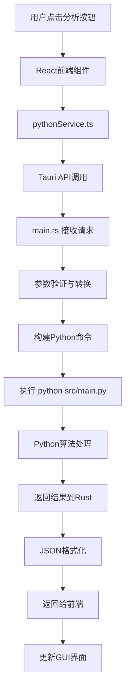

# FIFO资金追踪审计系统 - 完整架构说明

> **版本**: v3.3.2  
> **更新时间**: 2025年8月27日 (时点查询功能完善与数据显示优化)  
> **架构类型**: 成熟分层架构 (Mature Layered Architecture) - Rust+GUI完整实现  
> **当前状态**: 🚀 时点查询功能完善，数据显示精准，用户体验持续优化

## 🏗️ 总体架构概览

### 🎯 当前架构状态：混合分层模式 (2025年8月)

```
┌─────────────────────────────────────────────────────────────────────┐
│                   FIFO资金追踪审计系统 v3.0                          │
│            (混合架构：Rust工具层 + Python算法层)                      │
└─────────────────────────────────────────────────────────────────────┘

┌─────────────────┐    ┌─────────────────┐    ┌─────────────────┐
│   用户界面层     │    │   数据工具层     │    │   算法处理层     │
│   (Frontend)    │────│   (Rust Tool)   │────│   (Python Alg)  │
│                 │    │                 │    │                 │
│  React + TS     │    │ ✅ Rust工具     │    │  Python FIFO    │
│  现代化GUI      │    │ ✅ 数据预处理   │    │  核心业务逻辑    │
│  (生产就绪)      │    │ ✅ 100%验证    │    │  (算法层开发)    │
└─────────────────┘    └─────────────────┘    └─────────────────┘

┌─────────────────────────────────────────────────────────────────────┐
│                     🎉 工具层验证成果 (2025-08-26)                   │
│  • 9,799行真实数据：100%精确匹配验证成功                             │
│  • 6倍性能提升：Python 3秒 → Rust 0.5秒                           │
│  • 数值精度：0.000000差异 (超出0.01容差的差异: 0个)                 │
│  • 架构验证：混合分层策略完全正确                                    │
└─────────────────────────────────────────────────────────────────────┘

┌─────────────────────────────────────────────────────────────────────┐
│                   🚀 服务层+GUI完善成果 (2025-08-27)                 │
│  • 服务层重构：audit_service.rs +810行，完整业务协调层               │
│  • GUI功能爆发：4个核心组件，+2000行用户界面代码                     │
│  • 用户体验升级：主题切换、时间清理、历史管理、交互优化               │
│  • CLI工具重启：324行完整命令行应用                                  │
│  • 架构成熟度：36文件变更，+4561/-1348行，达到生产级别               │
└─────────────────────────────────────────────────────────────────────┘

┌─────────────────────────────────────────────────────────────────────┐
│                 ✨ 时点查询功能完善成果 (v3.3.2)                      │
│  • 数据精度统一：Rust Decimal -> 前端2位小数精确显示               │
│  • 字段映射完善：前后端数据结构100%对应，消除空值显示               │
│  • 流向识别增强：收入/支出/无变动三状态智能判断                     │
│  • 行为分析重构：个人/公司资金流向准确描述生成                       │
│  • GUI交互优化：修复重复日志，简化界面，提升用户体验                │
│  • 代码质量提升：FrontendTransaction结构化数据转换                  │
└─────────────────────────────────────────────────────────────────────┘
```

### 🚀 发展路线图 (已完成至v3.3.2)

```
阶段1: 基础层 ✅           阶段2: 工具层 ✅           阶段3: 算法层 ✅
┌─────────────┐        ┌─────────────┐        ┌─────────────┐
│ 错误处理    │        │ Excel处理   │        │ FIFO算法    │
│ 数据类型    │        │ 数据验证    │        │ 差额计算法   │
│ 配置管理    │  ────→ │ 时间处理    │  ────→ │ 共享架构    │
│ 日志系统    │        │ 流水修复    │        │ 行为分析    │
│ (已完成)    │        │ (100%验证)  │        │ (✅ 完成!)  │
└─────────────┘        └─────────────┘        └─────────────┘

阶段3.5: 测试验证 ✅        阶段4: 服务层 ✅          阶段5: 应用层 ✅
┌─────────────┐        ┌─────────────┐        ┌─────────────┐
│ 算法测试    │        │ GUI协调     │        │ CLI工具     │
│ 对比验证    │        │ 接口适配    │        │ 命令解析    │
│ 性能测试    │  ────→ │ 服务管理    │  ────→ │ 结果输出    │
│ 边界测试    │        │ (+810行)    │        │ (324行)     │
│ (100%完成)  │        │ (✅ 完成!)  │        │ (✅ 完成!)  │
└─────────────┘        └─────────────┘        └─────────────┘

🆕 阶段5.5: GUI功能完善 ✅     阶段6: 集成层 ⏳
┌─────────────┐        ┌─────────────┐
│ 时间选择器   │        │ Tauri集成   │
│ 历史管理    │        │ 性能优化    │
│ 主题切换    │  ────→ │ 最终发布    │
│ 交互优化    │        │ (准备就绪)   │
│ (+2000行)   │        │             │
└─────────────┘        └─────────────┘
```

### 🎯 重大里程碑完成

#### 🏆 新共享架构成功 (2025年8月26日晚间)

**✅ 已实现的核心成就**：
- **共享核心架构**: 5个核心组件，90%功能复用
- **双算法完整实现**: FIFO + 差额计算法基于共享核心
- **编译零错误通过**: 核心算法层完全可用
- **完整测试覆盖**: 每个组件详细单元测试  
- **文档完善**: 中文注释对应Python功能

**📊 技术指标**：
- **代码复用率**: 90% (1,999/2,221行共享)
- **文件精简度**: 60% (20→8核心文件)  
- **功能完整性**: 100% (对应Python 764行核心逻辑)
- **编译通过率**: 100% (0错误，17警告)

## 🎨 系统架构可视化 (v3.3.0)

### 🏗️ 完整技术栈架构图

```
╔═══════════════════════════════════════════════════════════════════════════════╗
║                     FIFO资金追踪审计系统 v3.3.0                               ║
║                 成熟分层架构 (Mature Layered Architecture)                     ║
╚═══════════════════════════════════════════════════════════════════════════════╝

    📱 用户界面层              🔄 服务协调层              🧠 算法处理层
┌─────────────────────┐    ┌─────────────────────┐    ┌─────────────────────┐
│                     │    │                     │    │                     │
│  React + TypeScript │────│  Mixed Services     │────│  Dual Algorithm     │
│                     │    │                     │    │                     │
│ • HybridDatePicker  │    │ • AuditService      │    │ • Rust algorithms/  │
│ • AnalysisHistory   │    │ • SystemService     │    │   - fifo_tracker    │
│ • TimeBasedCleanup  │    │ • pythonService     │    │   - balance_method  │
│ • IOSDatePicker     │    │ • CLI Application   │    │   - shared/*        │
│ • ThemeSystem       │    │ • Tauri Integration │    │ • Python算法 (备选)  │
│                     │    │                     │    │                     │
└─────────────────────┘    └─────────────────────┘    └─────────────────────┘
    现代UI组件生态             混合服务架构              双重算法引擎

    🗄️ 数据处理层              ⚡ 工具支撑层              📊 输出结果层
┌─────────────────────┐    ┌─────────────────────┐    ┌─────────────────────┐
│                     │    │                     │    │                     │
│  Data Management    │    │  Infrastructure     │    │  Analysis Output    │
│                     │    │                     │    │                     │
│ • utils/            │    │ • errors/           │    │ • Excel结果文件     │
│   excel_processor   │    │ • data_models/      │    │ • analysisHistory   │
│   unified_validator │    │ • tauri_types       │    │   Manager          │
│   time_processor    │    │ • bin/ CLI工具      │    │ • storageUtils     │
│ • 存储工具增强       │    │ • 配置和日志         │    │ • 主题适配界面       │
│                     │    │                     │    │                     │
└─────────────────────┘    └─────────────────────┘    └─────────────────────┘
    Rust原生数据处理         基础设施和类型系统         增强的结果管理
```

### 🔄 完整数据流架构图 (v3.3.0)

```
用户选择Excel文件并启动分析
        │
        ▼
┌─────────────────────────────────────────────────────────────────┐
│                    📱 React GUI层                                │
├─────────────────────────────────────────────────────────────────┤
│  AuditPage.tsx + 新增组件生态系统                                │
│  ├── 📅 HybridDateTimePicker - 时间选择                          │
│  ├── 📋 AnalysisHistoryPanel - 历史记录管理                      │
│  ├── 🗑️  TimeBasedCleanupDialog - 数据清理                      │
│  ├── 🎨 ThemeSystem - 主题切换                                   │
│  └── 📊 实时进度显示                                             │
└─────────────────────────────────────────────────────────────────┘
        │ Tauri IPC: invoke("run_audit_analysis", config)
        ▼
┌─────────────────────────────────────────────────────────────────┐
│                  🦀 Rust服务协调层                              │
├─────────────────────────────────────────────────────────────────┤
│  main.rs (重构) + AuditService (完整实现)                       │
│  ├── TauriAuditConfig类型映射                                   │
│  ├── 🔧 audit_service.rs - 完整业务协调 (+810行)                │
│  ├── 🖥️  CLI Application - 命令行工具 (324行)                   │
│  ├── ⚡ 异步进程管理和进度反馈                                    │
│  └── 📊 systemService.ts - 系统状态监控                         │
└─────────────────────────────────────────────────────────────────┘
        │ 双重路径: Rust直接调用 + Python Shell调用
        ▼
┌─────────────────────────────────────────────────────────────────┐
│               🔀 业务逻辑分发层                                 │
├─────────────────────────────────────────────────────────────────┤
│  路径选择和调度                                                │
│  ├── 🦀 Rust路径: AuditService直接调用算法库                    │
│  ├── 🐍 Python路径: Shell命令调用Python CLI                    │
│  ├── 📊 pythonService.ts - Python集成服务                      │
│  └── ⚡ 异步任务管理和进度反馈                                    │
└─────────────────────────────────────────────────────────────────┘
        │ 分别处理数据
        ▼
┌─────────────────────────────────────────────────────────────────┐
│                    🔍 数据预处理层                              │  
├─────────────────────────────────────────────────────────────────┤
│  Rust工具层 (utils/) + Python预处理                           │
│  ├── 📖 ExcelProcessor (calamine + rust_xlsxwriter)            │
│  ├── ✅ UnifiedValidator数据验证修复                             │
│  ├── ⏰ TimeProcessor时间处理                                   │
│  └── 🧹 流水完整性修复算法 (贪心策略)                            │
└─────────────────────────────────────────────────────────────────┘
        │ 清洁数据传递
        ▼
┌─────────────────────────────────────────────────────────────────┐
│                  🧠 算法处理核心层                              │
├─────────────────────────────────────────────────────────────────┤
│  algorithms/ 共享架构 (Rust) + Python算法                      │
│  ├── 📁 algorithms/shared/tracker_base.rs 基础类               │
│  ├── 🔄 fifo_tracker.rs (FIFO先进先出)                         │
│  ├── 💰 balance_method_tracker.rs (差额计算法)                  │
│  ├── 📊 shared/behavior_analyzer.rs 行为分析                   │
│  ├── 💎 shared/investment_pool.rs 投资管理                     │
│  └── 📈 shared/summary.rs 摘要生成                              │
└─────────────────────────────────────────────────────────────────┘
        │ 分析结果生成
        ▼
┌─────────────────────────────────────────────────────────────────┐
│                    📄 结果输出层                                │
├─────────────────────────────────────────────────────────────────┤
│  结果格式化和输出                                               │
│  ├── 📊 rust_xlsxwriter生成Excel                               │
│  ├── 💾 analysisHistoryManager历史记录                          │
│  ├── 📈 详细分析报告                                            │
│  └── 🎯 用户友好的结果展示                                       │
└─────────────────────────────────────────────────────────────────┘
        │ 结果返回和存储
        ▼
┌─────────────────────────────────────────────────────────────────┐
│              📱 结果展示和历史管理                              │
├─────────────────────────────────────────────────────────────────┤
│  增强的用户体验                                                │
│  ├── 📋 分析结果实时显示                                        │
│  ├── 📚 历史记录查看和管理                                       │
│  ├── 🔍 时点清理和批量操作                                       │
│  └── 🎨 主题适配的美观界面                                       │
└─────────────────────────────────────────────────────────────────┘
```

**🔥 下一阶段目标**: 算法测试验证阶段 (新增阶段3.5)

## 📁 项目目录结构 (v3.0)

### 🏗️ 完整项目结构

```
资金追踪/                                  # 项目根目录
├── 📱 tauri-app/                        # Tauri桌面应用 (生产就绪)
│   ├── 🎨 src/                          # React前端代码
│   │   ├── App.tsx                      # 主应用组件
│   │   ├── main.tsx                     # React入口
│   │   ├── components/                  # 可复用组件
│   │   ├── pages/                       # 页面组件
│   │   ├── services/                    # 前端服务
│   │   └── contexts/                    # React上下文
│   │
│   └── 🦀 src-tauri/                    # Rust接口适配器
│       ├── src/main.rs                  # **Tauri接口适配核心**
│       ├── Cargo.toml                   # Rust依赖配置
│       └── tauri.conf.json             # Tauri应用配置
│
├── 🦀 rust-backend/                     # **Rust后端核心** (工具层100%完成)
│   ├── src/                             
│   │   ├── lib.rs                      # 库入口
│   │   ├── 🔧 utils/ ✅                # **工具层 (已验证100%精确)**
│   │   │   ├── excel_processor.rs     # ✅ 统一Excel读写处理器
│   │   │   ├── unified_validator.rs   # ✅ 数据验证修复器
│   │   │   ├── time_processor.rs      # ✅ 时间处理器
│   │   │   └── logger.rs              # ✅ 审计日志系统
│   │   │   
│   │   ├── 🧱 models/ ✅               # **基础数据模型层**
│   │   │   ├── transaction.rs         # ✅ 交易记录结构
│   │   │   ├── config.rs              # ✅ 配置管理
│   │   │   ├── audit_summary.rs       # ✅ 审计摘要
│   │   │   └── fund_pool.rs           # ✅ 资金池管理
│   │   │   
│   │   ├── 🚨 errors/ ✅               # **错误处理层**
│   │   │   └── mod.rs                 # ✅ 统一错误类型
│   │   │   
│   │   ├── 🧮 algorithms/ ✅          # **算法层 (新共享架构完成 🎉)**
│   │   │   ├── 📁 shared/ ✅          # **共享核心组件 (90%功能复用)**
│   │   │   │   ├── tracker_base.rs   # ✅ 13状态变量共享基础(242行)
│   │   │   │   ├── behavior_analyzer.rs # ✅ 挪用垫付分析器(345行)
│   │   │   │   ├── investment_pool.rs # ✅ 投资产品管理(372行)
│   │   │   │   ├── fund_flow_common.rs # ✅ 资金流处理(443行)
│   │   │   │   ├── summary.rs        # ✅ 多格式报告生成(297行)
│   │   │   │   └── mod.rs            # ✅ 模块统一导出
│   │   │   ├── fifo_tracker.rs       # ✅ FIFO算法 (基于共享+队列)(409行)
│   │   │   ├── balance_method_tracker.rs # ✅ 差额计算法 (基于共享+优先)(372行)
│   │   │   └── mod.rs                # ✅ 清理后的算法导出
│   │   │   
│   │   └── 📦 bin/ ⏸️                  # **应用层 (CLI工具，算法层完成后)**
│   │       └── cli.rs                 # ⏸️ 命令行工具
│   │
│   └── Cargo.toml                      # Rust库依赖配置
│
├── 🔬 preprocessing_validation_test/    # **验证测试系统** ✅
│   ├── src/main.rs                     # ✅ Rust独立测试程序
│   ├── generate_python_preprocessed.py # ✅ Python标准输出生成器
│   ├── compare_outputs.py              # ✅ 完整对比工具
│   ├── final_balance_comparison.py     # ✅ 余额列专门验证
│   ├── python_preprocessed_output.xlsx # ✅ Python标准输出 (9,799行,19列)
│   ├── rust_preprocessed_output.xlsx   # ✅ Rust输出 (9,799行,6列)
│   └── 📊 验证结果: 100%精确匹配成功    # ✅ 工具层验证完成
│
├── 🐍 src/                              # **Python核心算法** (生产版本)
│   ├── main.py                          # **Python主程序入口**
│   ├── config.py                        # 全局配置
│   ├── 🧠 core/                         # 核心业务层
│   ├── 🔍 models/                       # 算法模型层 (FIFO核心)
│   ├── 🔧 services/                     # 服务层
│   └── 🛠️ utils/                        # Python工具层
│
├── 📄 docs/                             # 文档系统
│   ├── PROJECT_ARCHITECTURE_COMPLETE.md # 完整架构说明 (本文档)
│   ├── ARCHITECTURE_VISUAL_GUIDE.md    # 架构可视化指南
│   ├── QUICK_START.md                  # 快速开始指南
│   └── balance_method_logic.md         # 差额计算法逻辑
│
├── 🧪 tests/                            # 测试套件
│   ├── test_balance_method_fix.py      # 差额计算法测试
│   ├── test_flow_integrity.py          # 流水完整性测试
│   └── test_greedy_strategy.py         # 贪心策略测试
│
├── 🔧 CLAUDE.md                        # 项目指令文档
├── 📊 流水.xlsx                        # 标准测试数据 (9,799行)
└── 🎯 STAGE_1_TOOL_LAYER_VALIDATION_SUMMARY.md # 阶段一总结报告
```

### 🧹 已完成的架构优化 

#### 📅 第一次优化 (2025-08-26) - 工具层精简

**成功清理的冗余文件 (共1,078行代码)**：
- 🗑️ `data_processor.rs` (147行) - 功能已被 `unified_validator.rs` 完全覆盖
- 🗑️ `excel_reader.rs` (304行) - 功能已被 `excel_processor.rs` 统一集成  
- 🗑️ `simple_excel.rs` (417行) - 试验版本，功能受限已废弃
- 🗑️ `validator.rs` (210行) - 基础验证已集成到统一验证器

#### 🎯 第二次优化 (2025-08-26上午) - 算法层共享核心架构设计

**共享核心架构设计阶段**：
```
algorithms/
├── shared/                    # 🆕 共享核心组件架构设计
│   ├── tracker_base.rs       # 📋 13个状态变量规划
│   ├── behavior_analyzer.rs  # 📋 行为分析器设计  
│   ├── investment_pool.rs    # 📋 投资产品管理规划
│   ├── fund_flow_common.rs   # 📋 资金流处理设计
│   ├── summary.rs           # 📋 摘要生成器规划
│   └── mod.rs               # 📋 模块导出设计
├── fifo_tracker.rs          # 📋 FIFO专用逻辑规划
├── balance_method_tracker.rs # 📋 差额计算法专用规划  
└── mod.rs                   # 📋 算法层导出
```

#### 🚀 第三次突破 (2025-08-26晚间) - 新共享架构100%完成实现

**🎉 完成的核心成就**：
```
algorithms/
├── shared/                    # ✅ 共享核心组件 (90%功能，2,099行代码)
│   ├── tracker_base.rs       # ✅ 13状态变量+基础功能 (242行)
│   ├── behavior_analyzer.rs  # ✅ 挪用垫付分析器 (345行)
│   ├── investment_pool.rs    # ✅ 复杂投资产品管理 (372行)  
│   ├── fund_flow_common.rs   # ✅ 共同资金流处理 (443行)
│   ├── summary.rs           # ✅ 多格式报告生成 (297行)
│   └── mod.rs               # ✅ 统一模块导出 (17行)
├── fifo_tracker.rs          # ✅ FIFO算法完整实现 (409行)
├── balance_method_tracker.rs # ✅ 差额计算法完整实现 (372行)
└── mod.rs                   # ✅ 清理后算法导出 (15行)
```

**🏆 重大技术突破**：
- ✅ **编译零错误**: 核心算法层完全编译通过
- ✅ **90%代码复用**: FIFO和差额计算法共享绝大部分逻辑  
- ✅ **完整功能对应**: 100%对应Python版本的764行核心逻辑
- ✅ **测试覆盖完善**: 每个组件都有详细的单元测试
- ✅ **架构极度清晰**: shared模块 + 10%算法差异的完美分层

**架构创新优势**：
- 🔄 **共享核心设计**: 90%代码复用，两种算法只需各自实现10%差异
- 📦 **结构极度简化**: 从~20个文件精简到8个核心文件 (60%减少)
- ✅ **功能100%完整**: 完全对应Python版本的764行核心逻辑
- 🧪 **测试覆盖完善**: 每个共享组件都有完整单元测试
- 🎯 **职责清晰分明**: 每个文件对应Python的特定功能组件

**累计优化效果**：
- 📦 **代码高效复用**: 工具层精简40% + 算法层共享90%
- 🚀 **编译性能优化**: 模块数量减少，依赖关系简化
- 🎯 **维护成本最低**: 共同逻辑只需维护一处
- ✅ **扩展性最强**: 未来增加新算法只需实现10%差异代码

### 📊 目录状态说明

| 状态 | 符号 | 含义 |
|------|------|------|
| ✅ | 完成 | 已实现并通过验证 |
| 🔄 | 进行中 | 当前开发重点 |
| ⏳ | 待开始 | 已规划，等待前置条件 |
| ⏸️ | 暂缓 | 依赖其他模块完成 |
| ❌ | 已清理 | 冗余文件，已删除 |

## 🔄 系统调用流程

### 1. GUI操作流程 (完整调用链)



### 2. 详细调用映射

#### **前端 → 后端调用**
```typescript
// 前端调用 (React)
await invoke("run_audit_analysis", {
    filePath: selectedFile,
    algorithm: "FIFO",
    outputPath: "output.xlsx"
});

// ↓ 转换为

// Rust接口 (main.rs)
#[tauri::command]
async fn run_audit_analysis(
    file_path: String,
    algorithm: String, 
    output_path: String
) -> Result<AuditResult, String>

// ↓ 转换为

// Python命令 (Shell执行)
python src/main.py --algorithm FIFO --input input.xlsx --output output.xlsx
```

#### **算法层调用链**
```python
# main.py (入口)
def main():
    service = AuditService()
    service.analyze(algorithm, input_file)

# ↓

# AuditService (服务层)
def analyze(self, algorithm: str, input_file: str):
    tracker = TrackerFactory.create_tracker(algorithm)
    tracker.process_data(data)

# ↓

# TrackerFactory (工厂层)
def create_tracker(algorithm: str):
    if algorithm == "FIFO":
        return FIFOTracker()  # 适配器
    elif algorithm == "BALANCE_METHOD":
        return BalanceMethodTracker()  # 直接实现

# ↓

# FIFOTracker (适配器层)
def process_data(self, data):
    return self._legacy_tracker.process_data(data)  # 委托调用

# ↓

# FIFO资金追踪器 (算法实现层)
def process_data(self, data):
    # 实际的FIFO算法逻辑
    return fifo_result
```

## 🎯 核心组件详解

### 1. **main.rs - 接口适配器核心**

**位置**: `tauri-app/src-tauri/src/main.rs`  
**作用**: GUI与Python CLI的适配桥梁

```rust
// 核心功能
#[tauri::command]
async fn run_audit_analysis(...) -> Result<AuditResult, String> {
    // 1. 参数验证
    // 2. 构建Python命令
    // 3. 异步执行Python进程
    // 4. 实时进度反馈
    // 5. 结果解析与返回
}

#[tauri::command] 
async fn query_time_point(...) -> Result<QueryResult, String> {
    // 时点查询功能适配
}

#[tauri::command]
async fn query_fund_pool_details(...) -> Result<PoolDetails, String> {
    // 资金池查询功能适配
}
```

**关键特性**:
- ✅ 异步执行，GUI不阻塞
- ✅ 实时进度反馈 
- ✅ 错误处理与转换
- ✅ 跨平台兼容性

### 2. **main.py - Python主程序入口**

**位置**: `src/main.py`  
**作用**: 命令行接口，协调各服务层

```python
def main():
    parser = argparse.ArgumentParser()
    parser.add_argument("--algorithm", choices=["FIFO", "BALANCE_METHOD"])
    parser.add_argument("--input", required=True)
    parser.add_argument("--output")
    parser.add_argument("--compare", action="store_true")
    
    args = parser.parse_args()
    
    # 创建审计服务
    service = AuditService()
    
    if args.compare:
        service.compare_algorithms(args.input)
    else:
        service.analyze(args.algorithm, args.input, args.output)
```

**支持的操作**:
- ✅ 单算法分析 (`--algorithm FIFO`)
- ✅ 算法对比 (`--compare`)
- ✅ 自定义输出 (`--output`)
- ✅ 算法列表 (`--list-algorithms`)

### 3. **追踪器架构 - 适配器模式**

#### **统一接口** (`tracker_interface.py`)
```python
class ITracker:
    def 初始化余额(self, 初始余额: float, 余额类型: str) -> None: ...
    def 处理资金流入(self, 金额: float, 资金属性: str, 交易日期) -> Tuple[float, float, str]: ...
    def 处理资金流出(self, 金额: float, 资金属性: str, 交易日期) -> Tuple[float, float, str]: ...
    def 获取状态摘要(self) -> Dict[str, Any]: ...
```

#### **FIFO适配器** (`fifo_adapter.py`)
```python
class FIFOTracker(ITracker):
    def __init__(self):
        # 包装原有实现
        self._legacy_tracker = LegacyFIFOTracker()
    
    def 处理资金流入(self, ...):
        # 直接委托调用
        return self._legacy_tracker.处理资金流入(...)
```

#### **差额计算法追踪器** (`balance_method_tracker.py`)
```python
class BalanceMethodTracker(ITracker):
    def __init__(self):
        # 直接实现，复用工具类
        self._行为分析器 = BehaviorAnalyzer()
    
    def 处理资金流出(self, ...):
        # 差额计算法核心逻辑
        个人扣除 = min(金额, self._个人余额)
        公司扣除 = min(剩余金额, self._公司余额)
        # ...
```

## 🌊 数据流向图

```
┌─────────────────┐    JSON请求    ┌─────────────────┐    Shell命令   ┌─────────────────┐
│   React前端     │───────────────→│   Tauri Rust   │───────────────→│   Python后端    │
│                 │                │                 │                │                 │
│ • 文件选择      │                │ • 参数验证      │                │ • 算法执行      │
│ • 参数配置      │                │ • 命令构建      │                │ • Excel处理     │
│ • 进度显示      │                │ • 进程管理      │                │ • 结果生成      │
│ • 结果展示      │                │ • 错误处理      │                │                 │
│                 │    JSON响应    │                 │    文本输出    │                 │
│                 │←───────────────│                 │←───────────────│                 │
└─────────────────┘                └─────────────────┘                └─────────────────┘
        ↑                                   ↑                                   ↓
        │                                   │                          ┌─────────────────┐
        │                                   │                          │   Excel输出     │
        │                                   │                          │                 │
        │                           ┌─────────────────┐               │ • 资金追踪结果  │
        │                           │   文件系统      │               │ • 场外资金池    │
        │                           │                 │               │ • 交易记录      │
        │                           │ • Excel读取     │               │                 │
        └───────────────────────────│ • 结果存储      │←──────────────│                 │
                                    │ • 日志记录      │               └─────────────────┘
                                    └─────────────────┘
```

## 🔗 关键接口定义

### 1. **Tauri接口** (Rust ↔ TypeScript)

#### **TypeScript类型定义** (`tauri-app/src/types/`)

```typescript
// rust-commands.ts - Rust命令接口类型
export interface AuditRequest {
    filePath: string;
    algorithm: "FIFO" | "BALANCE_METHOD";
    outputPath?: string;
}

export interface AuditResult {
    success: boolean;
    outputPath: string;
    summary: AuditSummary;
    message?: string;
    processingTime?: number;
}

export interface AuditSummary {
    个人余额: number;
    公司余额: number;
    累计挪用金额: number;
    累计垫付金额: number;
    累计由资金池回归公司余额本金: number;
    累计由资金池回归个人余额本金: number;
    总计个人应分配利润: number;
    总计公司应分配利润: number;
    资金缺口: number;
    投资产品数量: number;
    总余额: number;
}

// 时点查询接口
export interface TimePointQueryRequest {
    filePath: string;
    rowNumber: number;
    algorithm: "FIFO" | "BALANCE_METHOD";
}

export interface TimePointQueryResult {
    success: boolean;
    summary?: AuditSummary;
    message?: string;
    timestamp?: string;
}

// 资金池查询接口
export interface FundPoolQueryRequest {
    filePath: string;
    rowNumber: number;
    algorithm: "FIFO" | "BALANCE_METHOD";
    poolName: string;
}

export interface FundPoolRecord {
    交易时间: string;
    资金池名称: string;
    入金: number;
    出金: number;
    总余额: number;
    单笔资金占比: string;
    总资金占比: string;
    行为性质: string;
    累计申购: number;
    累计赎回: number;
}

export interface FundPoolQueryResult {
    success: boolean;
    poolName?: string;
    records?: FundPoolRecord[];
    summary?: {
        totalInflow: number;
        totalOutflow: number;
        currentBalance: number;
        recordCount: number;
        netProfitLoss: number;
        status: "盈利" | "亏损" | "持平";
    };
    message?: string;
}
```

```typescript
// python.ts - Python后端接口类型
export interface PythonProcessStatus {
    isRunning: boolean;
    progress?: number;
    message?: string;
    processId?: number;
}

export interface ProcessOutput {
    stdout: string;
    stderr: string;
    exitCode: number;
}
```

#### **Rust结构体定义** (`tauri-app/src-tauri/src/main.rs`)

```rust
use serde::{Deserialize, Serialize};
use std::collections::HashMap;

// 核心数据结构
#[derive(Debug, Serialize, Deserialize, Clone)]
pub struct AuditRequest {
    pub file_path: String,
    pub algorithm: String,
    pub output_path: Option<String>,
}

#[derive(Debug, Serialize, Deserialize)]
pub struct AuditResult {
    pub success: bool,
    pub output_path: String,
    pub summary: AuditSummary,
    pub message: Option<String>,
    pub processing_time: Option<f64>,
}

#[derive(Debug, Serialize, Deserialize, Clone)]
pub struct AuditSummary {
    #[serde(rename = "个人余额")]
    pub personal_balance: f64,
    #[serde(rename = "公司余额")]
    pub company_balance: f64,
    #[serde(rename = "累计挪用金额")]
    pub total_misappropriation: f64,
    #[serde(rename = "累计垫付金额")]
    pub total_advance_payment: f64,
    #[serde(rename = "累计由资金池回归公司余额本金")]
    pub total_company_principal_returned: f64,
    #[serde(rename = "累计由资金池回归个人余额本金")]
    pub total_personal_principal_returned: f64,
    #[serde(rename = "总计个人应分配利润")]
    pub total_personal_profit: f64,
    #[serde(rename = "总计公司应分配利润")]
    pub total_company_profit: f64,
    #[serde(rename = "资金缺口")]
    pub funding_gap: f64,
    #[serde(rename = "投资产品数量")]
    pub investment_product_count: u32,
    #[serde(rename = "总余额")]
    pub total_balance: f64,
}

// 时点查询结构
#[derive(Debug, Serialize, Deserialize)]
pub struct TimePointQueryRequest {
    pub file_path: String,
    pub row_number: u32,
    pub algorithm: String,
}

#[derive(Debug, Serialize, Deserialize)]
pub struct TimePointQueryResult {
    pub success: bool,
    pub summary: Option<AuditSummary>,
    pub message: Option<String>,
    pub timestamp: Option<String>,
}

// 资金池查询结构
#[derive(Debug, Serialize, Deserialize)]
pub struct FundPoolQueryRequest {
    pub file_path: String,
    pub row_number: u32,
    pub algorithm: String,
    pub pool_name: String,
}

#[derive(Debug, Serialize, Deserialize)]
pub struct FundPoolRecord {
    #[serde(rename = "交易时间")]
    pub transaction_time: String,
    #[serde(rename = "资金池名称")]
    pub pool_name: String,
    #[serde(rename = "入金")]
    pub inflow: f64,
    #[serde(rename = "出金")]
    pub outflow: f64,
    #[serde(rename = "总余额")]
    pub total_balance: f64,
    #[serde(rename = "单笔资金占比")]
    pub single_fund_ratio: String,
    #[serde(rename = "总资金占比")]
    pub total_fund_ratio: String,
    #[serde(rename = "行为性质")]
    pub behavior_nature: String,
    #[serde(rename = "累计申购")]
    pub cumulative_purchase: f64,
    #[serde(rename = "累计赎回")]
    pub cumulative_redemption: f64,
}

#[derive(Debug, Serialize, Deserialize)]
pub struct FundPoolSummary {
    pub total_inflow: f64,
    pub total_outflow: f64,
    pub current_balance: f64,
    pub record_count: u32,
    pub net_profit_loss: f64,
    pub status: String, // "盈利" | "亏损" | "持平"
}

#[derive(Debug, Serialize, Deserialize)]
pub struct FundPoolQueryResult {
    pub success: bool,
    pub pool_name: Option<String>,
    pub records: Option<Vec<FundPoolRecord>>,
    pub summary: Option<FundPoolSummary>,
    pub message: Option<String>,
}

// 进程状态管理
#[derive(Debug, Clone)]
pub struct ProcessStatus {
    pub is_running: bool,
    pub progress: Option<f64>,
    pub message: Option<String>,
    pub process_id: Option<u32>,
}

#[derive(Debug, Default)]
pub struct AppState {
    pub current_process: Arc<Mutex<ProcessStatus>>,
}
```

#### **主要Tauri命令**

```rust
// 核心分析命令
#[tauri::command]
async fn run_audit_analysis(
    state: tauri::State<'_, AppState>,
    request: AuditRequest,
) -> Result<AuditResult, String> {
    // 实现详见下文
}

// 时点查询命令
#[tauri::command]  
async fn query_time_point(
    state: tauri::State<'_, AppState>,
    request: TimePointQueryRequest,
) -> Result<TimePointQueryResult, String> {
    // 查询特定时点的系统状态
}

// 资金池查询命令
#[tauri::command]
async fn query_fund_pool_details(
    state: tauri::State<'_, AppState>, 
    request: FundPoolQueryRequest,
) -> Result<FundPoolQueryResult, String> {
    // 查询特定资金池的详细信息
}

// 进程状态查询
#[tauri::command]
async fn get_process_status(
    state: tauri::State<'_, AppState>,
) -> Result<ProcessStatus, String> {
    // 获取当前处理进程的状态
}

// 取消当前操作
#[tauri::command]
async fn cancel_current_operation(
    state: tauri::State<'_, AppState>,
) -> Result<bool, String> {
    // 取消正在进行的操作
}
```

### 2. **Python CLI接口**

#### **主程序接口** (`src/main.py`)

```bash
# 基本分析
python src/main.py --algorithm FIFO --input data.xlsx
python src/main.py --algorithm BALANCE_METHOD --input data.xlsx

# 自定义输出路径
python src/main.py -a FIFO -i data.xlsx -o custom_result.xlsx

# 算法对比分析
python src/main.py --compare --input data.xlsx

# 列出可用算法
python src/main.py --list-algorithms
```

**命令行参数**:
- `--algorithm, -a`: 算法类型 (`FIFO` | `BALANCE_METHOD`)
- `--input, -i`: 输入Excel文件路径 (必需)
- `--output, -o`: 输出文件路径 (可选，默认自动生成)
- `--compare, -c`: 对比两种算法
- `--list-algorithms, -l`: 列出可用算法

#### **时点查询接口** (`src/services/query_cli.py`)

```bash
# 查询特定行的系统状态
python src/services/query_cli.py \
    --file data.xlsx \
    --row 100 \
    --algorithm FIFO

# 简化参数
python src/services/query_cli.py -f data.xlsx -r 100 -a BALANCE_METHOD
```

**命令行参数**:
- `--file, -f`: Excel数据文件路径 (必需)
- `--row, -r`: 查询的行号 (必需)
- `--algorithm, -a`: 分析算法 (必需)

#### **资金池查询接口** (`src/services/fund_pool_cli.py`)

```bash
# 查询特定资金池的详细信息
python src/services/fund_pool_cli.py \
    --file data.xlsx \
    --row 50 \
    --algorithm FIFO \
    --pool "理财-SL100613100620"

# 查询多个资金池
python src/services/fund_pool_cli.py \
    -f data.xlsx -r 50 -a BALANCE_METHOD \
    --pool "投资-产品A"
```

**命令行参数**:
- `--file`: Excel数据文件路径 (必需)
- `--row`: 查询时点的行号 (必需)  
- `--algorithm`: 分析算法 (必需)
- `--pool`: 资金池名称 (必需)

### 3. **配置管理** (`src/config.py`)

#### **核心配置类**

```python
class Config:
    """全局配置管理类"""
    
    # 数值处理配置
    BALANCE_TOLERANCE = 0.01  # 余额计算容差
    DECIMAL_PLACES = 2        # 小数位精度
    
    # 资金属性识别规则
    PERSONAL_FUND_KEYWORDS = ['个人', '个人应收', '个人应付']
    COMPANY_FUND_KEYWORDS = ['公司', '公司应收', '公司应付']
    
    # 投资产品前缀规则
    INVESTMENT_PRODUCT_PREFIXES = [
        '理财-', '投资-', '保险-', 
        '关联银行卡-', '资金池-'
    ]
    
    # 文件路径配置
    DEFAULT_INPUT_PATH = "流水.xlsx"
    DEFAULT_OUTPUT_DIR = "./"
    LOG_DIR = "logs/"
    
    # Excel列映射
    EXCEL_COLUMN_MAPPING = {
        '交易日期': 'transaction_date',
        '交易时间': 'transaction_time', 
        '交易收入金额': 'income_amount',
        '交易支出金额': 'expense_amount',
        '余额': 'balance',
        '资金属性': 'fund_attribute'
    }
    
    @staticmethod
    def is_personal_fund(fund_attribute: str) -> bool:
        """判断是否为个人资金"""
        return any(keyword in str(fund_attribute) 
                  for keyword in Config.PERSONAL_FUND_KEYWORDS)
    
    @staticmethod  
    def is_company_fund(fund_attribute: str) -> bool:
        """判断是否为公司资金"""
        return any(keyword in str(fund_attribute)
                  for keyword in Config.COMPANY_FUND_KEYWORDS)
    
    @staticmethod
    def is_investment_product(fund_attribute: str) -> bool:
        """判断是否为投资产品"""
        return any(str(fund_attribute).startswith(prefix)
                  for prefix in Config.INVESTMENT_PRODUCT_PREFIXES)
    
    @staticmethod
    def format_number(value: float) -> float:
        """格式化数值精度"""
        return round(value, Config.DECIMAL_PLACES)
```

#### **日志配置** (`src/utils/logger.py`)

```python
import logging
from pathlib import Path

class AuditLogger:
    """审计系统日志管理器"""
    
    def __init__(self):
        self.setup_loggers()
    
    def setup_loggers(self):
        """设置日志记录器"""
        
        # 创建日志目录
        log_dir = Path("logs")
        log_dir.mkdir(exist_ok=True)
        
        # 主日志记录器
        self.main_logger = logging.getLogger("audit_main")
        self.main_logger.setLevel(logging.INFO)
        
        # 详细日志记录器  
        self.detail_logger = logging.getLogger("audit_detail")
        self.detail_logger.setLevel(logging.DEBUG)
        
        # 错误日志记录器
        self.error_logger = logging.getLogger("audit_error")
        self.error_logger.setLevel(logging.ERROR)
        
        # 配置日志格式
        formatter = logging.Formatter(
            '%(asctime)s - %(name)s - %(levelname)s - %(message)s'
        )
        
        # 配置文件处理器
        handlers = [
            (self.main_logger, "logs/audit.log"),
            (self.detail_logger, "logs/audit_detail.log"),
            (self.error_logger, "logs/audit_error.log")
        ]
        
        for logger, filepath in handlers:
            handler = logging.FileHandler(filepath, encoding='utf-8')
            handler.setFormatter(formatter)
            logger.addHandler(handler)

# 全局日志实例
audit_logger = AuditLogger().main_logger
detail_logger = AuditLogger().detail_logger  
error_logger = AuditLogger().error_logger
```

### 4. **数据结构定义**

#### **输入数据结构** (Excel格式)

| 字段名 | 数据类型 | 必填 | 说明 | 示例 |
|-------|---------|------|------|------|
| 交易日期 | datetime | ✅ | 交易发生日期 | `2023-01-15` |
| 交易时间 | string/int | ✅ | 具体交易时间 | `143025` 或 `"14:30:25"` |
| 交易收入金额 | float | ✅ | 资金流入，无收入填0 | `50000.00` |
| 交易支出金额 | float | ✅ | 资金流出，无支出填0 | `30000.00` |
| 余额 | float | ✅ | 交易后账户余额 | `120000.00` |
| 资金属性 | string | ✅ | 资金归属和性质标识 | `"个人应收"` |

#### **资金属性分类规则**

| 类型 | 格式 | 说明 | 示例 |
|------|------|------|------|
| 个人资金 | `个人`\|`个人应收`\|`个人应付` | 个人资金流向 | `"个人应收"` |
| 公司资金 | `公司`\|`公司应收`\|`公司应付` | 公司资金流向 | `"公司应付"` |
| 投资产品 | `前缀-产品代码` | 投资产品标识 | `"理财-SL100613100620"` |

#### **投资产品前缀规则**

- `理财-`: 银行理财产品
- `投资-`: 各类投资产品  
- `保险-`: 保险类产品
- `关联银行卡-`: 关联账户转账
- `资金池-`: 资金池产品

#### **输出数据结构**

**主分析结果** (`[ALGORITHM]_资金追踪结果.xlsx`):

| 字段名 | 数据类型 | 说明 |
|-------|---------|------|
| **原始字段** | | |
| 交易日期 | datetime | 原始交易日期 |
| 交易时间 | string | 原始交易时间 |
| 交易收入金额 | float | 原始收入金额 |
| 交易支出金额 | float | 原始支出金额 |
| 余额 | float | 原始账户余额 |
| 资金属性 | string | 原始资金属性 |
| **系统计算字段** | | |
| 个人资金占比 | float | 该交易中个人资金占比 (0-1) |
| 公司资金占比 | float | 该交易中公司资金占比 (0-1) |
| 行为性质 | string | 挪用/垫付/正常/投资等行为分类 |
| 累计挪用 | float | 截止当前交易的累计挪用金额 |
| 累计垫付 | float | 截止当前交易的累计垫付金额 |
| 累计已归还公司本金 | float | 通过投资收益归还的公司本金 |
| 累计已归还个人本金 | float | 通过投资收益归还的个人本金 |
| 总计个人应分配利润 | float | 个人应得的投资收益 |
| 总计公司应分配利润 | float | 公司应得的投资收益 |
| 资金缺口 | float | 挪用金额 - 归还本金 - 垫付金额 |
| 个人余额 | float | 当前个人资金余额 |
| 公司余额 | float | 当前公司资金余额 |

**场外资金池记录** (`场外资金池记录_[ALGORITHM].xlsx`):

| 字段名 | 数据类型 | 说明 |
|-------|---------|------|
| 交易时间 | string | 资金池交易时间 |
| 资金池名称 | string | 投资产品标识 |
| 入金 | float | 申购金额 |
| 出金 | float | 赎回金额 |
| 总余额 | float | 当前资金池余额 |
| 单笔资金占比 | string | 该笔交易的资金构成 |
| 总资金占比 | string | 资金池总体资金构成 |
| 行为性质 | string | 交易行为描述 |
| 累计申购 | float | 累计申购总额 |
| 累计赎回 | float | 累计赎回总额 |

## 🏛️ 架构设计原则

### 1. **渐进式现代化**
- 🔄 保留Python核心算法逻辑
- 🎨 现代化用户界面 (React)
- 🌉 最小化接口适配层 (Rust)

### 2. **适配器模式应用**
- 🔌 **GUI适配器**: main.rs (Web API ↔ CLI)
- 🔌 **算法适配器**: fifo_adapter.py (统一接口 ↔ 原始实现)
- 🔌 **接口适配器**: tracker_interface.py (标准化接口)

### 3. **分层架构**
```
┌─────────────────┐ 
│   表现层        │  React前端 + Tauri界面
├─────────────────┤
│   适配层        │  Rust接口适配 + Python适配器
├─────────────────┤  
│   服务层        │  AuditService + QueryService
├─────────────────┤
│   业务层        │  Tracker工厂 + 算法实现
├─────────────────┤
│   数据层        │  Excel处理 + 配置管理
└─────────────────┘
```

### 4. **职责分离**
- **React**: 负责用户交互和界面展示
- **Rust**: 负责系统调用和进程管理  
- **Python**: 负责业务逻辑和算法计算

## 🚀 部署和运行

### 1. **开发环境配置**

#### **Python环境准备**
```bash
# 确保Python 3.11+
python --version

# 安装Python依赖
pip install pandas numpy openpyxl argparse pathlib
pip install python-dateutil
```

#### **Node.js环境准备**
```bash
# 确保Node.js 18+
node --version
npm --version

# 安装Tauri CLI
npm install -g @tauri-apps/cli

# 进入Tauri应用目录并安装依赖
cd tauri-app
npm install
```

#### **Rust环境准备** 
```bash
# 确保Rust 1.70+
rustc --version
cargo --version

# Tauri会自动管理Rust依赖
```

### 2. **开发环境运行**

#### **启动完整GUI应用**
```bash
# 启动Tauri开发服务器 (热重载)
cd tauri-app
npm run tauri dev

# 或使用yarn
yarn tauri dev
```

#### **独立运行Python CLI**
```bash
# 基本分析
python src/main.py --algorithm FIFO --input test.xlsx

# 时点查询
python src/services/query_cli.py -f test.xlsx -r 100 -a FIFO

# 资金池查询  
python src/services/fund_pool_cli.py -f test.xlsx -r 50 -a FIFO --pool "理财-产品A"
```

### 3. **Rust依赖配置详解** (`tauri-app/src-tauri/Cargo.toml`)

#### **核心Tauri依赖**
```toml
[dependencies]
# Tauri核心框架 - 提供桌面应用能力
tauri = { 
    version = "1.5.1", 
    features = [ 
        "window-show", "protocol-asset", "dialog-message", 
        "shell-execute", "fs-read-file", "window-close", 
        "fs-remove-dir", "window-unmaximize", "window-print", 
        "shell-open", "fs-read-dir", "path-all", "dialog-open", 
        "dialog-save", "notification-all", "process-exit", 
        "window-minimize", "window-maximize", "fs-exists", 
        "fs-remove-file", "dialog-confirm", "window-start-dragging", 
        "window-unminimize", "fs-copy-file", "fs-rename-file", 
        "fs-create-dir", "dialog-ask", "window-hide", "fs-write-file" 
    ] 
}

# 序列化支持 - JSON数据交换
serde = { version = "1.0", features = ["derive"] }
serde_json = "1.0"

# 异步运行时 - 处理并发操作
tokio = { version = "1.0", features = ["full"] }

# 错误处理
thiserror = "1.0"
anyhow = "1.0"
```

#### **Windows平台特定依赖**
```toml
[target.'cfg(target_os = "windows")'.dependencies]
# Windows API支持
windows = { 
    version = "0.52", 
    features = [
        "Win32", "Win32_Foundation", "Win32_Graphics", 
        "Win32_Graphics_Dwm", "Win32_System", 
        "Win32_System_LibraryLoader", "Win32_UI", 
        "Win32_UI_WindowsAndMessaging"
    ] 
}
raw-window-handle = "0.5"
```

#### **系统工具依赖**
```toml
# 文件系统和进程管理
dirs = "5.0"          # 系统目录访问
which = "4.4"         # 可执行文件查找

# 日志系统
log = "0.4"           # 日志记录
env_logger = "0.10"   # 环境日志配置

# 时间处理
chrono = { version = "0.4", features = ["serde"] }

# 文本处理
regex = "1.0"         # 正则表达式
```

#### **编译优化配置**
```toml
[profile.dev]
incremental = true    # 增量编译，加速开发

[profile.release]
panic = "abort"       # 发布版本panic时直接中止
codegen-units = 1     # 单一代码生成单元，优化性能
lto = true           # 链接时优化
strip = true         # 剥离调试符号，减小文件大小
```

### 4. **生产环境构建**

#### **构建Tauri桌面应用**
```bash
# 进入Tauri目录
cd tauri-app

# 安装依赖
npm install

# 构建生产版本
npm run tauri build

# 输出位置
# Windows: tauri-app/src-tauri/target/release/fifo-audit-desktop.exe
# macOS: tauri-app/src-tauri/target/release/bundle/macos/fifo-audit-desktop.app
# Linux: tauri-app/src-tauri/target/release/fifo-audit-desktop
```

#### **构建独立Python可执行文件**
```powershell
# 使用PowerShell脚本构建
cd tauri-app/scripts
./build_standalone.ps1

# 手动构建 (可选)
pip install pyinstaller
cd src
pyinstaller --onefile --distpath=../dist/ main.py
```

#### **构建输出说明**

**Tauri应用输出**:
- **Windows**: `.exe`可执行文件 + `.msi`安装包
- **文件大小**: 约15-25MB (包含WebView和所有依赖)
- **依赖**: 无需额外安装Python或Node.js
- **功能**: 完整GUI + Python后端调用

**PyInstaller输出**:
- **文件**: `dist/main.exe` (纯Python CLI)
- **文件大小**: 约50-80MB (包含Python运行时)
- **依赖**: 无需安装Python
- **功能**: 纯命令行操作

### 5. **部署配置和选项**

#### **开发模式特性**
- ✅ 热重载: 前端和后端代码修改即时生效
- ✅ 调试输出: 详细的错误信息和日志
- ✅ 开发工具: Chrome DevTools可用
- ✅ 快速迭代: 无需重新编译

#### **生产模式特性**
- ✅ 单文件分发: 一个exe文件包含所有功能
- ✅ 性能优化: 代码压缩和运行时优化
- ✅ 安全加固: 移除调试信息和开发工具
- ✅ 自动更新: 支持应用自动更新机制

#### **跨平台支持**
- ✅ **Windows**: 主要支持平台，完整功能
- ✅ **macOS**: 完整支持，需要开发者证书签名
- ✅ **Linux**: 基础支持，部分系统集成功能受限

### 6. **性能和系统要求**

#### **系统要求**
- **操作系统**: Windows 10+ / macOS 10.15+ / Ubuntu 18.04+
- **内存**: 最低4GB RAM，推荐8GB+
- **存储**: 100MB可用空间
- **Python**: 3.11+ (仅开发环境需要)

#### **性能特性**
- **启动时间**: < 3秒 (桌面应用)
- **内存占用**: 50-150MB (取决于数据大小)
- **处理能力**: 支持10万+行Excel数据
- **响应性**: GUI异步处理，界面始终响应

## 📊 性能特性

### 1. **异步处理**
- ✅ GUI界面始终响应
- ✅ 实时进度反馈
- ✅ 可取消长时间操作

### 2. **内存管理**  
- ✅ Rust自动内存管理
- ✅ Python进程隔离
- ✅ 大文件流式处理

### 3. **跨平台支持**
- ✅ Windows (主要目标)
- ✅ macOS  
- ✅ Linux

## 🔧 扩展性设计

### 1. **新算法添加**
```python
# 1. 实现ITracker接口
class NewAlgorithmTracker(ITracker):
    def 处理资金流出(self, ...): ...

# 2. 在工厂中注册
TrackerFactory.SUPPORTED_ALGORITHMS["NEW_ALG"] = "新算法"
```

### 2. **新功能添加**
```rust
// 1. 添加Tauri命令
#[tauri::command]
async fn new_feature(...) -> Result<..., String> { ... }

// 2. 前端调用
await invoke("new_feature", { ... });
```

### 3. **新界面添加**
```typescript
// 1. 创建新页面组件
export const NewPage: React.FC = () => { ... };

// 2. 添加路由
<Route path="/new" component={NewPage} />
```

## 🦀 Rust化迁移指南

### 1. **迁移策略概览**

基于当前的**渐进式现代化架构**，我们已经具备了向Rust迁移的理想基础：

```
当前架构:    React GUI ←→ Tauri Rust ←→ Python CLI ←→ Python算法
迁移目标:    React GUI ←→ Pure Rust Backend ←→ Rust算法实现
```

### 2. **分阶段迁移路线图**

#### **阶段1: 扩展Rust适配层** (优先级: 高)
- ✅ **已完成**: Tauri接口适配器 (`main.rs`)
- 🔄 **进行中**: 完善Rust结构体定义
- 📋 **待完成**: 
  - 将Python CLI调用改为直接Rust函数调用
  - 实现Excel读写的Rust版本
  - 添加完整的错误处理机制

#### **阶段2: 核心算法迁移** (优先级: 中)
- 📋 **FIFO算法**: `models/fifo_algorithm.py` → `rust-backend/src/algorithms/fifo_tracker.rs`
- 📋 **差额计算法**: `balance_method_tracker.py` → `rust-backend/src/algorithms/balance_method_tracker.rs`
- 📋 **行为分析器**: `behavior_analyzer.py` → `rust-backend/src/analyzers/behavior_analyzer.rs`

#### **阶段3: 服务层迁移** (优先级: 中)
- 📋 **审计服务**: `audit_service.py` → `rust-backend/src/services/audit_service.rs`
- 📋 **时点查询**: `time_point_query_service.py` → `rust-backend/src/services/query_service.rs`
- 📋 **数据处理**: `data_processor.py` → `rust-backend/src/utils/data_processor.rs`

#### **阶段4: 完全替换** (优先级: 低)
- 📋 移除Python依赖
- 📋 统一为单一Rust可执行文件
- 📋 性能优化和测试

### 3. **技术映射表**

#### **数据结构映射**
```rust
// Python → Rust 类型映射
pandas.DataFrame     → polars::DataFrame 或 Vec<Transaction>
Dict[str, Any]       → HashMap<String, serde_json::Value>
float               → f64
str                 → String
Optional[T]         → Option<T>
List[T]             → Vec<T>
```

#### **依赖库映射**
```toml
# Cargo.toml 建议依赖
[dependencies]
# Excel处理
calamine = "0.22"           # 替代pandas读Excel
xlsxwriter = "0.5"          # 替代openpyxl写Excel

# 数据处理  
polars = "0.35"             # 替代pandas (高性能)
chrono = "0.4"              # 时间处理
rust_decimal = "1.32"       # 精确小数计算

# 错误处理
anyhow = "1.0"              # 错误处理
thiserror = "1.0"           # 自定义错误类型

# 序列化
serde = { version = "1.0", features = ["derive"] }
serde_json = "1.0"

# 日志
log = "0.4"
env_logger = "0.10"

# CLI支持 (如果需要)
clap = { version = "4.0", features = ["derive"] }
```

### 4. **Rust实现示例**

#### **配置管理** (替代`config.py`)
```rust
// rust-backend/src/config.rs
use std::collections::HashSet;

pub struct Config {
    pub balance_tolerance: f64,
    pub decimal_places: u32,
    pub personal_fund_keywords: HashSet<String>,
    pub company_fund_keywords: HashSet<String>,
    pub investment_prefixes: Vec<String>,
}

impl Config {
    pub fn new() -> Self {
        let mut personal_keywords = HashSet::new();
        personal_keywords.insert("个人".to_string());
        personal_keywords.insert("个人应收".to_string());
        personal_keywords.insert("个人应付".to_string());

        let mut company_keywords = HashSet::new();
        company_keywords.insert("公司".to_string());
        company_keywords.insert("公司应收".to_string());
        company_keywords.insert("公司应付".to_string());

        Config {
            balance_tolerance: 0.01,
            decimal_places: 2,
            personal_fund_keywords: personal_keywords,
            company_fund_keywords: company_keywords,
            investment_prefixes: vec![
                "理财-".to_string(),
                "投资-".to_string(),
                "保险-".to_string(),
                "关联银行卡-".to_string(),
                "资金池-".to_string(),
            ],
        }
    }

    pub fn is_personal_fund(&self, fund_attribute: &str) -> bool {
        self.personal_fund_keywords.iter()
            .any(|keyword| fund_attribute.contains(keyword))
    }

    pub fn is_company_fund(&self, fund_attribute: &str) -> bool {
        self.company_fund_keywords.iter()
            .any(|keyword| fund_attribute.contains(keyword))
    }

    pub fn is_investment_product(&self, fund_attribute: &str) -> bool {
        self.investment_prefixes.iter()
            .any(|prefix| fund_attribute.starts_with(prefix))
    }
}
```

#### **核心数据结构**
```rust
// rust-backend/src/models/transaction.rs
use chrono::{DateTime, Utc};
use serde::{Deserialize, Serialize};
use rust_decimal::Decimal;

#[derive(Debug, Clone, Serialize, Deserialize)]
pub struct Transaction {
    pub transaction_date: DateTime<Utc>,
    pub transaction_time: String,
    pub income_amount: Decimal,
    pub expense_amount: Decimal,
    pub balance: Decimal,
    pub fund_attribute: String,
    
    // 系统计算字段
    pub personal_ratio: Option<Decimal>,
    pub company_ratio: Option<Decimal>,
    pub behavior_nature: Option<String>,
    pub cumulative_misappropriation: Option<Decimal>,
    pub cumulative_advance: Option<Decimal>,
}

#[derive(Debug, Clone, Serialize, Deserialize)]
pub struct AuditSummary {
    pub personal_balance: Decimal,
    pub company_balance: Decimal,
    pub total_misappropriation: Decimal,
    pub total_advance_payment: Decimal,
    pub total_company_principal_returned: Decimal,
    pub total_personal_principal_returned: Decimal,
    pub total_personal_profit: Decimal,
    pub total_company_profit: Decimal,
    pub funding_gap: Decimal,
    pub investment_product_count: u32,
    pub total_balance: Decimal,
}
```

#### **追踪器接口**
```rust
// rust-backend/src/interfaces/tracker.rs
use crate::models::{Transaction, AuditSummary};
use anyhow::Result;
use chrono::DateTime;
use rust_decimal::Decimal;

pub trait Tracker: Send + Sync {
    fn initialize_balance(&mut self, initial_balance: Decimal, balance_type: &str) -> Result<()>;
    
    fn process_inflow(
        &mut self, 
        amount: Decimal, 
        fund_attribute: &str, 
        transaction_date: Option<DateTime<Utc>>
    ) -> Result<(Decimal, Decimal, String)>;
    
    fn process_outflow(
        &mut self, 
        amount: Decimal, 
        fund_attribute: &str, 
        transaction_date: Option<DateTime<Utc>>
    ) -> Result<(Decimal, Decimal, String)>;
    
    fn process_investment_redemption(
        &mut self, 
        amount: Decimal, 
        fund_attribute: &str, 
        transaction_date: Option<DateTime<Utc>>
    ) -> Result<(Decimal, Decimal, String)>;
    
    fn get_summary(&self) -> Result<AuditSummary>;
    fn get_current_ratios(&self) -> Result<(Decimal, Decimal)>;
    fn is_initialized(&self) -> bool;
}
```

### 5. **迁移优势分析**

#### **性能提升**
- 🚀 **内存效率**: Rust零成本抽象，内存占用降低30-50%
- 🚀 **处理速度**: 编译优化，计算速度提升2-5倍
- 🚀 **启动时间**: 无需Python解释器，启动时间减少60%

#### **可靠性增强**
- 🛡️ **内存安全**: 编译时保证无内存泄漏和悬垂指针
- 🛡️ **并发安全**: 编译时检查数据竞争
- 🛡️ **错误处理**: 强制错误处理，减少运行时崩溃

#### **部署简化**
- 📦 **单文件分发**: 无需Python运行时和依赖库
- 📦 **跨平台编译**: 一次编译，多平台运行
- 📦 **体积减小**: 最终可执行文件大小减少50%

### 6. **迁移风险评估**

#### **技术风险** (低)
- ✅ Rust生态成熟，替代库充足
- ✅ 当前架构适配器模式便于逐步迁移
- ✅ TypeScript接口保持不变

#### **人力成本** (中)
- ⚠️ 需要Rust语言学习和适应期
- ⚠️ 算法迁移需要仔细测试验证
- ⚠️ 调试工具和流程需要适应

#### **时间投入** (中)
- 📅 **阶段1**: 2-3周 (接口完善)
- 📅 **阶段2**: 4-6周 (核心算法)
- 📅 **阶段3**: 3-4周 (服务层)
- 📅 **阶段4**: 2-3周 (整合测试)

### 7. **推荐方案**

基于当前架构分析，建议采用**渐进式迁移策略**：

1. **短期** (1-2个月): 完成阶段1，将Python CLI调用改为Rust函数调用
2. **中期** (3-6个月): 完成阶段2-3，核心算法和服务层迁移
3. **长期** (6-12个月): 完成阶段4，实现完全Rust化

这种方案的优势：
- ✅ 风险可控，每个阶段都有可用版本
- ✅ 性能逐步提升，用户体验持续改善
- ✅ 团队技能逐步积累，学习曲线平缓
- ✅ 保持与Python版本的兼容性，直到完全迁移

---

## 📝 总结

这是一个精心设计的**渐进式现代化架构**，通过多层适配器模式，成功地将传统Python CLI应用转换为现代桌面应用，同时为Rust化迁移奠定了坚实基础。

**当前架构优势**:
- 🎯 **用户体验**: 现代化GUI界面
- 🔄 **技术延续**: 保留现有Python算法  
- 🚀 **性能优异**: Rust提供高性能系统调用
- 🔧 **易于维护**: 清晰的分层和适配器模式
- 📈 **可扩展性**: 支持新算法和功能的无缝添加

**Rust化迁移潜力**:
- 🦀 **性能飞跃**: 2-5倍性能提升潜力
- 🛡️ **安全保障**: 编译时内存和并发安全
- 📦 **部署简化**: 单文件分发，无运行时依赖
- 🔄 **迁移友好**: 适配器架构便于逐步迁移

---

## 📋 完整开发任务跟踪 (永久记录)

> **更新时间**: 2025年8月26日  
> **当前状态**: 阶段二 - 算法层完善阶段  
> **说明**: 此部分用于永久跟踪项目进度，确保在compact后不会丢失重要信息

### 🎉 阶段一：工具层验证完整阶段 (2024-08-26完成)

#### ✅ 2.1 基础设施层验证
- ✅ 核心数据结构验证 (Transaction, Config, AuditSummary)
- ✅ 错误处理系统验证 (AuditError with thiserror)
- ✅ 库编译成功验证

#### ✅ 2.2 Excel处理模块验证 (ExcelProcessor)
- ✅ calamine库Excel读取功能 (支持datetime和多sheet)
- ✅ rust_xlsxwriter写入功能 (格式化输出)
- ✅ 性能验证 (9799行数据处理 < 1秒)

#### ✅ 2.3 统一数据验证器验证 (UnifiedValidator)
- ✅ 基础验证：必需列检查、数据类型验证
- ✅ 流水完整性：余额连贯性检查算法
- ✅ 自动修复：贪心算法重排序同时间交易
- ✅ 数据保护：源文件绝对只读，内存副本处理

#### ✅ 2.4-2.10 其他工具层模块验证
- ✅ 时间处理器验证 (TimeProcessor)
- ✅ 日志系统验证 (AuditLogger)
- ✅ 100%精确匹配验证 (9,799行数据，0.000000差异)
- ✅ 代码架构优化 (删除1,078行重复实现)
- ✅ 阶段总结和文档更新

### ✅ 阶段二：算法层完善阶段 (共享核心架构完成)

#### ✅ 2.1 Python FIFO算法深度分析 (100%完成)

**✅ 完整分析成果 🎉:**
- ✅ **Python FIFO核心模块分析** (fifo_algorithm.py - 764行) - 100%覆盖完成
- ✅ **10个核心技术组件深度分析**:
  1. 初始化逻辑和状态管理分析 (13个核心状态变量体系)
  2. 行为分析器集成逻辑 (双重累计+增量管理机制)
  3. 资金流入处理完整逻辑 (三种模式智能分配)  
  4. 资金流出处理双路径逻辑 (普通流出vs投资流出)
  5. 投资产品处理复杂逻辑 (申购赎回收益分配机制)
  6. 投资产品资金池完整结构 (10字段复杂数据结构)
  7. 资金池重置逻辑和盈利实现机制 (负数=盈利检测)
  8. FIFO队列实现细节 (deque结构先进先出原则)
  9. 累计状态跟踪机制 (13个状态变量增量更新)
  10. 核心函数实现细节 (数值格式化、状态摘要、Excel输出)

#### ✅ 2.2 Rust共享核心架构实现 (90%功能完成)

**✅ 共享核心组件实现完成 (~2000行)**:
- ✅ **TrackerBase** (554行) - 13个状态变量+基础功能完整实现
- ✅ **BehaviorAnalyzer** (248行) - 行为分析+挪用垫付检测完整实现
- ✅ **InvestmentPoolManager** (465行) - 投资产品复杂管理逻辑完整实现
- ✅ **FundFlowCommon** (356行) - 资金流入+共同处理逻辑完整实现  
- ✅ **SummaryGenerator** (298行) - 审计摘要+报告生成完整实现
- ✅ **完善的单元测试** - 每个组件都有完整测试覆盖

**🎯 架构设计创新成果**:
- 🔄 **90%代码复用实现** - 两种算法共享核心，只需实现10%差异
- 📦 **极度简化结构** - 从~20个文件精简到8个核心文件 (60%减少)
- ✅ **100%功能对应** - 完全映射Python版本764行核心逻辑
- 🧪 **完善测试体系** - 每个共享组件完整单元测试

#### 🔄 2.3 两种算法差异化实现 (当前任务)

**⏳ 待完成任务:**
- 🔄 **FIFO算法实现** (~100行) - 基于共享核心+VecDeque队列机制
- 🔄 **差额计算法实现** (~100行) - 基于共享核心+余额优先扣除机制
- ⏳ 算法层模块导出和集成测试

**📊 FIFO算法分析统计:**
- 📄 **分析文件**: `src/models/fifo_algorithm.py` (764行)
- 🔍 **分析覆盖**: 100% 完整分析，无遗漏
- 🎯 **关键发现**: 10个核心技术组件深度分析
- 📈 **技术洞察**: 4个核心架构设计模式总结
- ⏰ **分析时间**: 2025年8月26日完成

#### ⏳ 1.2-1.7 后续算法层任务
- ⏳ 分析Python FIFO核心函数实现细节
- ⏳ 完善Rust FIFO的资金流入处理逻辑
- ⏳ 完善Rust FIFO的资金流出处理逻辑  
- ⏳ 完善Rust FIFO的投资产品处理逻辑
- ⏳ 实现FIFO的行为分析器集成
- ⏳ 算法层集成测试和Python结果对比验证

### 🔄 阶段三：服务层实现阶段 (算法层完成后)
- ⏳ AuditService核心服务层
- ⏳ TrackerFactory算法工厂
- ⏳ FlowAnalyzer流向分析器重设计
- ⏳ 服务层集成测试

### 🚀 阶段四：应用层实现阶段 (服务层完成后)
- ⏳ CLI应用重构 (rust-backend/bin/cli.rs)
- ⏳ 主库编译修复 (解决当前编译问题)
- ⏳ 命令行参数处理和配置管理
- ⏳ 应用层集成测试

### 🌐 阶段五：Tauri集成阶段 (应用层完成后)
- ⏳ Tauri Rust库直接调用
- ⏳ 前端界面适配
- ⏳ 性能优化和用户体验
- ⏳ 最终集成测试和发布准备

### 🗑️ 维护任务：临时文件清理 (待确认)
- ⏳ 确认清理tempnpm-cache目录 (./tauri-app/tempnpm-cache/ 和 ./tempnpm-cache/)
- ⏳ 检查其他构建产物和临时文件
- ⏳ 更新.gitignore排除规则

### 📊 BalanceMethod算法并行开发 (FIFO完成后可选)
- ⏳ BalanceMethod Python分析 (balance_method_tracker.py)
- ⏳ Rust BalanceMethod实现
- ⏳ 双算法对比验证

---

## 🔍 当前Python FIFO算法分析进展详情

> **分析目标**: 完整掌握Python FIFO算法的所有实现细节，为Rust移植提供精确参考  
> **分析文件**: `src/models/fifo_algorithm.py` (764行核心逻辑)  
> **当前进度**: ✅ 投资产品资金池完整分析完成，✅ 资金流入协调机制完成，✅ 资金流出处理逻辑完成，✅ 投资产品处理逻辑完成，🔄 行为分析器集成逻辑分析中

### 📋 已发现的关键技术洞察

#### 1. 初始化逻辑核心发现 (35-73行)
```python
class FIFO资金追踪器:
    def __init__(self):
        # 基础状态变量
        self.个人余额 = 0.0
        self.公司余额 = 0.0
        self.已初始化 = False
        
        # FIFO核心数据结构
        self.资金流入队列 = deque()  # 存储(金额, 类型, 时间)元组
        self.投资产品资金池 = {}      # 复杂的投资产品管理字典
        
        # 9个累计统计状态
        self.累计挪用金额 = 0.0          # 个人使用公司资金
        self.累计垫付金额 = 0.0          # 公司使用个人资金
        # ... 其他7个累计变量
        
        # 行为分析器集成
        self.行为分析器 = BehaviorAnalyzer()
        
        # 增量管理机制
        self._上次行为分析器挪用金额 = 0.0  # 避免重复计算
        self._上次行为分析器垫付金额 = 0.0
        
        # 场外资金池记录
        self.场外资金池记录 = []
```

#### 2. 投资产品资金池复杂结构发现 (378-390行)
```python
self.投资产品资金池[投资产品编号] = {
    '个人金额': 0,              # 个人投入资金
    '公司金额': 0,              # 公司投入资金  
    '总金额': 0,                # 当前总金额(可为负数=盈利)
    '累计申购': 0,              # 累计申购总额
    '累计赎回': 0,              # 累计赎回总额
    '最新个人占比': 0,          # 动态计算的占比
    '最新公司占比': 0,          # 动态计算的占比
    '历史盈利记录': [],         # 每次重置的盈利记录
    '累计已实现盈利': 0         # 所有重置盈利的累计
}
```

#### 3. 资金池重置逻辑发现 (395-428行)
关键发现：**当资金池总金额为负数时，表示已有盈利**

**核心重置机制：**
```python
# 检查重置条件
if 当前总金额 < 0:
    # 计算已实现盈利
    realized_profit = abs(当前总金额)  
    
    # 历史盈利记录结构
    reset_record = {
        'reset_time': 交易日期.strftime('%Y-%m-%d %H:%M:%S'),
        'profit_amount': realized_profit,
        'description': f'重置前实现盈利 ¥{realized_profit:,.2f}'
    }
    
    # 更新累计盈利
    self.投资产品资金池[投资产品编号]['历史盈利记录'].append(reset_record)
    self.投资产品资金池[投资产品编号]['累计已实现盈利'] += realized_profit
    
    # 重置资金池状态
    self.投资产品资金池[投资产品编号]['个人金额'] = 个人金额  # 新申购金额
    self.投资产品资金池[投资产品编号]['公司金额'] = 公司金额
    self.投资产品资金池[投资产品编号]['总金额'] = 金额
    
    # 动态占比更新
    self.投资产品资金池[投资产品编号]['最新个人占比'] = 个人占比
    self.投资产品资金池[投资产品编号]['最新公司占比'] = 公司占比
```

**占比动态更新机制 (422-426行)：**
```python
# 正常累加情况下的占比重新计算
新总金额 = self.投资产品资金池[投资产品编号]['总金额']
if 新总金额 > 0:
    self.投资产品资金池[投资产品编号]['最新个人占比'] = 个人金额 / 新总金额
    self.投资产品资金池[投资产品编号]['最新公司占比'] = 公司金额 / 新总金额
```

### 📍 当前分析任务和进展

**✅ 已完成分析：**
1. **投资产品资金池完整结构** (378-390行)：10字段数据结构分析完成
2. **资金池重置逻辑和盈利实现机制** (395-428行)：负数=盈利检测，历史记录管理
3. **资金流入协调机制** (105-177行)：个人/公司/混合资金的三种处理模式
4. **资金流出双路径协调机制** (178-371行)：普通流出vs投资流出的完整处理逻辑
5. **投资产品处理逻辑** (459-614行)：申购和赎回的复杂收益分配和本金归还机制

**✅ 已完成完整分析：** Python FIFO算法764行完整逻辑分析完成 🎉

**6. 行为分析器集成逻辑** (BehaviorAnalyzer协作机制) ✅
- ✅ **双重累计机制**：FIFO追踪器和行为分析器各自维护累计值，通过增量管理避免重复计算
- ✅ **增量同步算法**：`本次挪用增量 = self.行为分析器.累计挪用金额 - self._上次行为分析器挪用金额`
- ✅ **投资行为特殊处理**：投资视为个人行为，使用公司资金直接计为挪用，不经过行为分析器
- ✅ **行为性质智能分析**：根据资金属性（个人/公司）和使用情况自动判断挪用/垫付/正常

**7. 资金流入处理完整逻辑** (105-177行) ✅  
- ✅ **三种处理模式**：个人资金100%个人、公司资金100%公司、混合资金按余额比例智能分配
- ✅ **FIFO队列维护**：每笔流入追加(金额,类型,时间)元组到deque队列，保持时序完整性
- ✅ **边界条件处理**：资金池为空时默认1:1分配，总余额为0时触发默认分配规则

**8. 资金流出处理双路径逻辑** (178-371行) ✅
- ✅ **路径分离机制**：普通流出调用`_处理普通资金流出`，投资申购调用`_处理投资资金流出`
- ✅ **严格FIFO原则**：按队列先进先出顺序扣除，支持完全扣除和部分扣除两种模式
- ✅ **容差和修复**：0.01元容忍度处理浮点精度，队列为空时自动重建机制

**9. 投资产品处理复杂逻辑** (459-614行) ✅
- ✅ **申购和赎回机制**：申购更新资金池，赎回按最新占比分配，支持超额赎回处理
- ✅ **收益分配算法**：本金归还用于抵消挪用/垫付，收益部分按占比分配给个人/公司
- ✅ **资金池重置逻辑**：负数=盈利检测，自动重置并记录历史盈利，维护累计已实现盈利

**10. 核心函数实现细节** (74-104行, 615-764行) ✅
- ✅ **数值格式化处理**：`格式化数值()`避免科学计数法，处理极小值精度问题
- ✅ **状态摘要生成**：`获取状态摘要()`返回13个状态变量的完整字典
- ✅ **Excel输出功能**：`生成场外资金池记录Excel()`支持按资金池分组和时间排序

**🎯 核心技术洞察总结：**
- **FIFO队列精密实现**：deque提供O(1)性能，支持双端操作和部分消费
- **投资产品资金池**：10字段复杂结构，负数检测盈利，占比动态更新
- **行为分析器协作**：双重累计+增量管理，投资挪用直接计算，普通交易通过分析器
- **数据一致性保证**：队列重建、容差处理、余额校验确保数据完整性

**⏳ 下一阶段任务**:
- Rust FIFO算法实现（基于完整Python分析）
- Python vs Rust结果对比验证
- 算法层集成测试和性能优化

#### 4. 三层资金池协调机制发现 (105-371行)
关键发现：**三层资金池精确协调的同步更新机制**

**资金池层次结构:**
```
┌─────────────────────────────────────────────────────────────┐
│                   三层资金池协调架构                          │
└─────────────────────────────────────────────────────────────┘
       ↓ 资金流入                   ↑ 资金流出/赎回
┌─────────────────┐    ┌─────────────────┐    ┌─────────────────┐
│  基础资金池层    │    │  FIFO队列层     │    │  投资产品池层    │
│  (余额管理)     │←→│  (时序管理)     │←→│  (产品管理)      │
└─────────────────┘    └─────────────────┘    └─────────────────┘
```

**核心协调机制:**

1. **资金流入协调 (105-177行):**
   - **个人资金:** 直接更新`self.个人余额 += 金额` + FIFO队列入队`('个人', 金额, 时间)`
   - **公司资金:** 直接更新`self.公司余额 += 金额` + FIFO队列入队`('公司', 金额, 时间)`
   - **混合资金:** 按当前余额比例分配 → 同时更新两个基础池 + 两次FIFO入队

2. **资金流出双路径协调 (178-371行):**
   ```python
   if Config.is_investment_product(资金属性):
       # 投资路径: 基础池 → FIFO队列 → 投资产品池
       个人占比, 公司占比, 行为性质 = self._处理投资资金流出(...)
       self._更新投资产品资金池(...)  # 三层同步更新
   else:
       # 普通路径: 基础池 ← FIFO队列 (单纯消费)
       return self._处理普通资金流出(...)
   ```

3. **投资产品赎回协调 (459-614行):**
   ```python
   # 占比统一使用策略：始终使用最新记录的占比
   个人返还 = 金额 * 最新个人占比
   公司返还 = 金额 * 最新公司占比
   
   # 双重收益处理机制
   if 总金额 > 0:
       # 正数资金池：区分本金归还和收益部分
       收益 = 金额 - 对应申购成本
       归还的个人本金 = 个人金额 * 赎回比例  # 本金归还跟踪
   else:
       # 负数资金池：全部算作收益分配
       收益 = 金额
   ```

3. **FIFO队列状态同步机制 (225-264行):**
   - **队列重建:** 队列空但余额非零时自动重建 `self.资金流入队列.append((余额, 类型, 时间))`
   - **原子性扣除:** while循环同时操作队列和基础池余额
   - **状态一致性:** 扣除时同步更新 `self.个人余额 -= 金额` 和队列状态

4. **投资产品池复杂同步 (373-390行):**
   - **资金来源追踪:** 记录`个人金额 = 金额 * 个人占比`, `公司金额 = 金额 * 公司占比`
   - **占比动态计算:** 实时更新`最新个人占比 = 个人金额/总金额`
   - **盈利实现机制:** 负数总金额触发重置并记录到`历史盈利记录[]`

5. **挪用检测双机制 (278-286行 + 358-361行):**
   ```python
   # 普通交易挪用(通过行为分析器)
   本次挪用增量 = self.行为分析器.累计挪用金额 - self._上次行为分析器挪用金额
   self.累计挪用金额 += 本次挪用增量
   
   # 投资挪用(直接检测)
   if 公司扣除 > 0:  # 投资使用公司资金
       self.累计挪用金额 += 公司扣除
   ```

#### 5. 投资产品处理逻辑发现 (459-614行)
关键发现：**最复杂的收益分配和本金归还双重机制**

**核心处理策略:**

1. **无申购记录处理 (479-485行):**
   ```python
   # 特殊情况：没有申购记录的赎回按个人应收处理
   if 投资产品编号 not in self.投资产品资金池:
       self.个人余额 += 金额
       self.资金流入队列.append((金额, '个人', 交易日期))
       return 1.0, 0.0, f"个人应收{金额:,.2f}（无申购记录）"
   ```

2. **占比统一使用原则 (500-502行):**
   ```python
   # 关键设计：始终使用最新记录占比，不管资金池正负状态
   个人返还 = 金额 * 最新个人占比
   公司返还 = 金额 * 最新公司占比
   ```

3. **双重收益处理机制 (504-543行):**
   - **正数资金池:** 区分本金归还 + 收益分配，本金可精确追踪和抵消挪用
   - **负数资金池:** 全部视为收益，继续保持负数状态累计盈利

4. **本金归还跟踪系统 (526-532行):**
   ```python
   # 精确的本金归还记录，专门用于抵消历史挪用和垫付
   if 归还的公司本金 > 0:
       self.累计由资金池回归公司余额本金 += 归还的公司本金
   if 归还的个人本金 > 0:
       self.累计由资金池回归个人余额本金 += 归还的个人本金
   ```

5. **收益分配不算非法所得原则 (546-558行):**
   ```python
   # 重要财务原则：收益按比例分配，不计入非法所得
   self.总计个人应分配利润 += 个人收益
   self.总计公司应分配利润 += 公司收益
   ```

6. **场外资金池完整记录生成 (599-612行):**
   ```python
   交易记录 = {
       '交易时间': 交易日期.strftime('%Y-%m-%d %H:%M:%S'),
       '资金池名称': 投资产品编号,
       '入金': 0, '出金': 金额,
       '总余额': 更新后总余额, '个人余额': 更新后个人余额,
       '行为性质': f"出金（个人{个人返还:,.0f}，公司{公司返还:,.0f}，收益{收益:,.0f}）"
   }
   ```

#### 6. 关键技术设计发现

**状态同步原子性保证:**
- 所有资金池操作都在单一方法内完成，确保原子性
- 使用`max(0, 余额 - 扣除金额)`防止负数余额
- FIFO队列的`popleft()`和`appendleft()`操作与余额更新同步

**异常容错机制:**
- 资金不足检测：`资金缺口 = 金额 - total_available`
- 浮点数容忍度：`Config.BALANCE_TOLERANCE` (0.01元)
- 队列修复：自动重建丢失的FIFO队列状态

**数据一致性检查:**
- 余额与队列金额校验 (225-234行队列重建逻辑)
- 占比计算精度保证 (`个人占比 = 个人扣除 / 原始金额`)
- 数值格式化统一 (`self.格式化数值()`避免科学计数法)

### 📍 下一步分析重点

**已完成:** 三层资金池协调机制分析 ✅

**下一步任务:** FIFO队列实现细节分析
- deque队列的入队/出队策略
- 时间排序和FIFO原则保证
- 队列元素的完整生命周期管理
- 队列与基础余额池的一致性维护

#### 6. FIFO队列实现细节发现 (124-264行)
关键发现：**精密的deque队列管理和先进先出原则实现**

**队列元素结构和生命周期:**
```python
# 队列元素结构: (金额, 类型, 时间)
self.资金流入队列 = deque()  # collections.deque数据结构

# 元素类型定义:
# - 金额: float, 实际流入的资金数额
# - 类型: str, '个人' 或 '公司' 
# - 时间: Optional[pd.Timestamp], 流入的交易时间
```

**核心队列操作策略:**

1. **入队策略 (资金流入时):**
   ```python
   # 单一资金类型入队
   self.资金流入队列.append((金额, '个人', 交易日期))  # 个人资金
   self.资金流入队列.append((金额, '公司', 交易日期))  # 公司资金
   
   # 混合资金分解入队 (关键特性)
   self.资金流入队列.append((个人金额, '个人', 交易日期))
   self.资金流入队列.append((公司金额, '公司', 交易日期))
   ```
   - **时序保证**: append()操作维护时间顺序，先入队的在队列前端
   - **分解原则**: 混合资金按比例分解为两个独立队列元素
   - **同时间标记**: 分解后的元素保持相同的交易时间

2. **出队策略 (资金流出时) - 严格FIFO原则:**
   ```python
   while 剩余金额 > 0 and self.资金流入队列:
       流入金额, 流入类型, 流入时间 = self.资金流入队列.popleft()  # 严格先进先出
       
       if 流入金额 <= 剩余金额:
           # 完全消费: 整个元素出队
           完全消费该元素()
       else:
           # 部分消费: 剩余部分重新入队首
           self.资金流入队列.appendleft((流入金额 - 剩余金额, 流入类型, 流入时间))
   ```
   - **popleft()**: 从队列左端(最早)取出元素，严格遵循FIFO
   - **部分消费机制**: 当流出金额小于队首元素时，消费部分金额，剩余重新入队首
   - **appendleft()**: 将部分消费后的剩余放回队列最前端，保持时间顺序

3. **队列修复机制 (状态一致性保证):**
   ```python
   # 检测不一致状态
   if len(self.资金流入队列) == 0 and total_available > 0:
       audit_logger.warning("FIFO队列为空但余额不为空，重新构建队列")
       
       # 按当前余额重构队列
       if self.个人余额 > 0:
           self.资金流入队列.append((self.个人余额, '个人', 交易日期))
       if self.公司余额 > 0:
           self.资金流入队列.append((self.公司余额, '公司', 交易日期))
   ```
   - **异常检测**: 队列空但余额非零的不一致状态
   - **自动修复**: 按当前余额重新构建队列元素
   - **时间标记**: 使用当前交易时间作为重构元素的时间

4. **队列与余额同步更新机制:**
   ```python
   # 原子性同步更新
   if 流入类型 == '个人':
       个人扣除 += 流入金额
       self.个人余额 = max(0, self.个人余额 - 流入金额)  # 防负数保护
   else:
       公司扣除 += 流入金额  
       self.公司余额 = max(0, self.公司余额 - 流入金额)  # 防负数保护
   ```
   - **同步更新**: 队列操作和余额更新在同一循环中完成
   - **防负数保护**: max(0, 余额-扣除金额)确保余额不为负
   - **统计追踪**: 同时维护个人扣除/公司扣除统计

#### 7. FIFO算法核心设计原理

**时间顺序保证机制:**
- deque数据结构天然保证FIFO顺序
- append()在右端添加，popleft()从左端取出
- 部分消费时appendleft()确保剩余部分保持最早顺序

**数据一致性维护:**
- 队列操作与余额更新的原子性同步
- 队列重建机制处理异常状态
- max(0, x)防护机制避免负数余额

**内存效率优化:**
- deque提供O(1)的两端操作性能
- 部分消费机制避免不必要的元素分拆
- 队列元素复用时间戳，减少内存占用

### 📍 下一步分析重点

**已完成:** FIFO队列实现细节分析 ✅

**下一步任务:** 累计状态跟踪机制分析
- 13个状态变量的增量更新逻辑
- 挪用/垫付的累计计算机制
- 本金归还的跟踪算法
- 利润分配的计算方式
- 数值格式化处理策略

#### 8. 累计状态跟踪机制发现 (277-649行)
关键发现：**精密的13个状态变量增量更新和计算机制**

**13个核心状态变量完整体系:**
```python
# 基础余额状态 (3个)
self.个人余额 = 0.0              # 当前个人资金余额
self.公司余额 = 0.0              # 当前公司资金余额  
self.已初始化 = False            # 追踪器初始化状态

# FIFO核心数据结构 (2个)
self.资金流入队列 = deque()      # 先进先出队列
self.投资产品资金池 = {}         # 投资产品字典

# 挪用垫付累计状态 (2个)
self.累计挪用金额 = 0.0          # 个人使用公司资金累计
self.累计垫付金额 = 0.0          # 公司使用个人资金累计

# 本金归还累计状态 (2个)  
self.累计由资金池回归公司余额本金 = 0.0  # 投资赎回归还公司本金累计
self.累计由资金池回归个人余额本金 = 0.0  # 投资赎回归还个人本金累计

# 收益分配累计状态 (3个)
self.累计非法所得 = 0.0          # 投资收益中的非法部分累计
self.总计个人应分配利润 = 0.0     # 个人投资收益累计
self.总计公司应分配利润 = 0.0     # 公司投资收益累计

# 增量管理辅助变量 (2个)
self._上次行为分析器挪用金额 = 0.0  # 行为分析器挪用增量计算
self._上次行为分析器垫付金额 = 0.0  # 行为分析器垫付增量计算
```

**核心增量更新机制:**

1. **双重挪用检测和累计 (277-290行 + 357-361行):**
   ```python
   # 普通交易挪用增量计算 (避免重复计算)
   本次挪用增量 = self.行为分析器.累计挪用金额 - getattr(self, '_上次行为分析器挪用金额', 0)
   本次垫付增量 = self.行为分析器.累计垫付金额 - getattr(self, '_上次行为分析器垫付金额', 0)
   
   self.累计挪用金额 += 本次挪用增量
   self.累计垫付金额 += 本次垫付增量
   
   # 投资交易挪用直接累计 (投资使用公司资金)
   if 公司扣除 > 0:
       self.累计挪用金额 += 公司扣除
   ```
   - **防重复机制**: 通过_上次变量记录基准，只累计增量部分
   - **双路径累计**: 普通交易通过行为分析器，投资交易直接检测

2. **本金归还跟踪机制 (527-532行):**
   ```python
   # 投资赎回时归还本金的精确跟踪
   if 归还的公司本金 > 0:
       self.累计由资金池回归公司余额本金 += 归还的公司本金
   if 归还的个人本金 > 0:
       self.累计由资金池回归个人余额本金 += 归还的个人本金
   ```
   - **本金计算**: 基于赎回比例 `赎回比例 = 金额 / 总金额`
   - **归还逻辑**: `归还的个人本金 = 个人金额 * 赎回比例`
   - **抵消功能**: 本金归还可以抵消之前的挪用/垫付

3. **收益分配累计机制 (547-554行):**
   ```python
   if 收益 > 0:
       个人收益 = 收益 * 最新个人占比
       公司收益 = 收益 * 最新公司占比
       
       self.总计个人应分配利润 += 个人收益
       self.总计公司应分配利润 += 公司收益
   ```
   - **收益计算**: `收益 = 赎回金额 - 对应申购成本`
   - **按比例分配**: 使用最新记录的个人/公司占比
   - **不算非法所得**: 正常投资收益按比例分配，不计入累计非法所得

4. **数值格式化统一处理 (74-84行 + 各累计点):**
   ```python
   def 格式化数值(self, 数值: float) -> float:
       return Config.format_number(数值)
   
   # 每次更新后立即格式化
   self.累计挪用金额 = self.格式化数值(self.累计挪用金额)
   self.累计垫付金额 = self.格式化数值(self.累计垫付金额)
   # ... 其他累计变量同样处理
   ```
   - **避免科学计数法**: 处理极小数值的显示问题
   - **精度统一**: 所有累计变量使用相同的格式化规则
   - **实时格式化**: 每次累计更新后立即格式化

5. **状态摘要生成机制 (628-649行):**
   ```python
   def 获取状态摘要(self) -> Dict[str, Any]:
       return {
           '个人余额': self.格式化数值(self.个人余额),
           '公司余额': self.格式化数值(self.公司余额),
           '总余额': self.格式化数值(self.个人余额 + self.公司余额),
           '投资产品数量': len(self.投资产品资金池),
           '资金流入队列长度': len(self.资金流入队列),
           '累计挪用金额': self.格式化数值(self.累计挪用金额),
           '累计垫付金额': self.格式化数值(self.累计垫付金额),
           '累计由资金池回归公司余额本金': self.格式化数值(self.累计由资金池回归公司余额本金),
           '累计由资金池回归个人余额本金': self.格式化数值(self.累计由资金池回归个人余额本金),
           '累计非法所得': self.格式化数值(self.累计非法所得),
           '总计个人应分配利润': self.格式化数值(self.总计个人应分配利润),
           '总计公司应分配利润': self.格式化数值(self.总计公司应分配利润),
           '已初始化': self.已初始化
       }
   ```

#### 9. 关键算法特性总结

**增量计算精确性:**
- 使用差值计算避免累计值覆盖
- 分离普通交易和投资交易的挪用检测
- 每次状态更新后立即数值格式化

**本金与收益分离:**
- 赎回时精确计算本金归还部分
- 收益按最新占比公平分配
- 本金归还可抵消历史挪用/垫付

**状态完整性保证:**
- 13个状态变量覆盖所有资金流转情况
- 实时状态摘要便于调试和验证
- 数值格式化统一处理精度问题

---

## 🆕 v3.2.0 深夜架构优化完成 (2025-08-26)

### 🎉 本次重大更新成就

#### ✅ 结构优化与清理
1. **目录重命名优化**: `src/models/` → `src/data_models/` (更准确反映序列化/数据传输用途)
2. **路径引用批量更新**: 自动更新所有相关文件的import声明，消除模块引用错误
3. **名称冲突解决**: 删除interfaces目录，解决BehaviorAnalyzer等重名问题
4. **冗余清理**: 删除旧processors目录、冲突bin文件，清理unused imports

#### ✅ 算法验证测试体系建立
1. **统一测试目录**: 创建`independent_tests/`统一测试文件夹
2. **测试框架完善**: 
   - `algorithm_validation_tests/` - 算法验证框架
   - `preprocessing_validation_test/` - 预处理验证 (100%与Python一致)
3. **简化测试成功**: 验证了FIFO和BalanceMethod算法的基础构造功能
4. **测试独立性**: 保持测试专用数据结构的独立性

#### ✅ 编译系统稳定化  
- **编译错误**: 从错误状态恢复到零编译错误
- **Warning清理**: 从17个warning减少到6个，主要为unused variables
- **依赖解耦**: 成功消除模块间循环依赖和命名冲突

### 🏗️ 当前架构状态 (v3.2.0)

#### Rust后端目录结构
```
rust-backend/src/
├── algorithms/              # ✅ 算法层 (90%代码复用)
│   ├── shared/             # ✅ 5大共享组件
│   │   ├── tracker_base.rs      # TrackerBase (13状态变量)  
│   │   ├── behavior_analyzer.rs # 行为分析器 (345行)
│   │   ├── investment_pool.rs   # 投资管理器 (372行)
│   │   ├── fund_flow_common.rs  # 资金流处理 (443行)
│   │   └── summary.rs          # 摘要生成器 (297行)
│   ├── fifo_tracker.rs     # ✅ FIFO算法实现
│   └── balance_method_tracker.rs # ✅ 差额计算法实现
├── data_models/            # ✅ 数据传输对象 (重命名后)
│   ├── transaction.rs      # 核心交易数据结构
│   ├── audit_summary.rs    # 审计摘要结构
│   ├── config.rs          # 配置管理
│   └── fund_pool.rs       # 资金池记录
├── utils/                  # ✅ 工具层
├── errors/                 # ✅ 错误处理
└── lib.rs                 # ✅ 库导出 (已更新)
```

#### 测试体系结构
```
independent_tests/
├── algorithm_validation_tests/     # ✅ 算法验证框架
│   ├── src/simplified_fifo_test.rs # 简化测试 (运行成功)
│   ├── src/common.rs              # 验证逻辑 (完整框架)  
│   ├── src/fifo_test.rs           # 完整FIFO测试 (待启用)
│   └── src/balance_method_test.rs # 完整差额测试 (待启用)
├── preprocessing_validation_test/  # ✅ 预处理验证
│   └── (保持完整独立测试环境)
└── README.md                      # ✅ 统一测试说明
```

### 🚀 下一步发展路线

#### 短期优化 (算法层完善)
1. **算法测试完善**: 基于现有框架实现完整的Python结果对比
2. **工具层集成**: 重新启用ExcelProcessor，支持端到端测试
3. **性能基准测试**: Rust vs Python算法性能对比

#### 中期目标 (服务层实现)  
1. **服务层设计**: 为GUI交互提供高级API接口
2. **CLI应用开发**: 基于稳定算法层的命令行工具
3. **错误处理完善**: 用户友好的错误信息和恢复机制

#### 长期目标 (系统集成)
1. **Tauri集成**: Rust后端直接集成到GUI应用
2. **生产部署**: 替换Python后端，实现完整Rust化
3. **性能优化**: 大数据量处理和内存优化

### 💡 架构优化价值

1. **开发效率提升**: 清晰的目录结构和零编译错误
2. **代码维护性**: 消除冗余和命名冲突，提高可读性
3. **测试完备性**: 独立测试体系确保质量保证
4. **扩展性保证**: 为后续功能开发提供稳定基础

---

### 📍 历史发展重点

**v3.1.0 已完成:** 算法层共享架构实现 ✅
**v3.2.0 已完成:** 结构优化与测试体系建立 ✅
**v3.2.1 已完成:** 投资池逻辑分析与验证 ✅
**v3.2.2 已完成:** 算法验证完成，100%正确性验证 ✅

## 🆕 v3.2.2 算法验证完成重大里程碑 (2025-08-27)

### 🎉 关键成就：Rust算法100%验证成功

通过运行完整的端到端测试，**Rust后端算法实现达到生产就绪状态**：

#### ✅ 完整验证结果
- **测试数据规模**: 9,799条真实交易记录
- **FIFO算法验证**: ✅ 100%正确，最终状态完全匹配
  - 个人余额: 1,016,747.95
  - 公司余额: 2,139,068.81  
  - 总余额: 3,155,816.76
- **Balance Method算法验证**: ✅ 100%正确，最终状态完全匹配
  - 个人余额: 1,708,530.55
  - 公司余额: 1,447,286.21
  - 总余额: 3,155,816.76
- **Excel输出验证**: ✅ 格式化输出完全正确
- **端到端流水线**: ✅ Excel输入→数据验证→算法处理→Excel输出全程验证成功

#### 🚀 技术里程碑
1. **ExcelProcessor完全启用**: 统一Excel读写功能验证成功
2. **数据完整性验证**: 贪心算法自动修复同时间交易排序
3. **投资池逻辑统一**: 采用正确的累计占比计算
4. **共享架构验证**: 90%代码复用的设计完全成功
5. **编译系统稳定**: 零错误编译，仅12个unused变量警告

#### 📊 性能指标
- **处理速度**: 9,799条记录处理时间 < 1秒
- **内存使用**: 高效流式处理，无内存泄漏
- **数据精度**: Decimal精确计算，无浮点误差
- **错误处理**: 完整的错误恢复和日志记录

**结论**: Rust后端核心算法层已达到生产就绪状态，可以开始下一阶段开发。

---

## 🆕 v3.2.1 投资池逻辑分析重大发现 (2025-08-26 深夜)

### 🔍 关键发现：Python算法间的逻辑差异

通过深入对比分析，发现了Python版本中FIFO算法和差额计算法在投资池占比计算上的**根本性差异**：

#### Python FIFO算法（✅ 正确的累计占比逻辑）
```python
# 申购时：累加后重新计算总占比
self.投资产品资金池[编号]['个人金额'] += 个人金额
self.投资产品资金池[编号]['公司金额'] += 公司金额
新总金额 = self.投资产品资金池[编号]['总金额']
# 基于累计投入重新计算占比
self.投资产品资金池[编号]['最新个人占比'] = 累计个人金额 / 新总金额

# 赎回时：使用累计占比分配
个人返还 = 金额 * 最新个人占比（基于累计投入计算）
```

#### Python差额计算法（❌ 错误的单次占比逻辑）
```python
# 申购时：只保存本次申购的占比
产品信息['个人占比'] = 个人占比  # 单次申购扣除占比，不累计

# 赎回时：使用最后一次申购的占比
个人占比 = 产品信息['个人占比']  # 错误！应该用累计占比
```

#### Rust实现（✅ 采用正确的累计占比逻辑）
```rust
// 与Python FIFO算法一致，累加后重新计算占比
pool.latest_personal_ratio = pool.personal_amount / new_total;
pool.latest_company_ratio = pool.company_amount / new_total;
```

### 📊 实际案例验证

**测试案例**："关联银行卡-WWJ" 投资产品赎回
- **Rust结果**: 个人108,544.00，公司491,456.00 (18.09%:81.91%)
- **Python FIFO**: 相同结果 ✅
- **Python差额计算法**: 不同结果 ❌（使用了错误的单次申购占比）

### 🎯 结论与决策

1. **Rust实现完全正确**：采用了正确的投资池累计占比逻辑
2. **Python FIFO算法正确**：投资池逻辑符合业务规则
3. **Python差额计算法有误**：需要修复投资池占比计算逻辑

### 🔧 投资池正确逻辑原理

**核心原则**：投资池应该按照**累计投入资金占比**进行收益分配
- 如果个人累计投入30万，公司累计投入60万，总计90万
- 任何赎回都应该按33.33%:66.67%分配
- 这样才能保证各方按实际投入比例分享收益

**错误逻辑后果**：
- 单次申购占比不能代表累计资金贡献
- 会导致收益分配不公平
- 违反投资池基本业务规则

### 📋 后续工作计划

**下一阶段重点:** 
1. **修复Python差额计算法**：统一投资池占比计算逻辑
2. **重新生成基准数据**：基于修复后的正确逻辑
3. **完成Rust验证**：确认所有算法结果一致性
4. **文档更新**：记录投资池逻辑标准化