# FLUX资金追踪分析系统

<div align="center">

**🌍 语言 / Language**: **中文** | [English](./README_EN.md)

</div>

<div align="center">


**司法审计专用工具 - 检测公款挪用、职务侵占等经济犯罪行为**

</div>

## 🚀 快速开始

### 💾 直接下载安装
想要立即使用？直接下载安装包即可：

**⬇️ [点击下载 FLUX资金追踪分析系统_3.3.4_x64-setup.exe](./FLUX资金追踪分析系统_3.3.4_x64-setup.exe)**

- 📦 **文件大小**: 约25MB
- 🖥️ **系统要求**: Windows 10/11 x64
- ⚡ **安装时间**: 1-2分钟
- 🔧 **无需配置**: 安装即用，无需额外依赖

---

## 📋 项目介绍

**FLUX资金追踪分析系统**是一款专为司法审计设计的桌面应用程序，能够精确分析银行流水数据，识别资金挪用、职务侵占等经济犯罪行为模式。

### 🎯 核心功能
- **📊 智能流水分析**: 支持FIFO（先进先出）和差额计算法两种算法
- **🔍 时点精确查询**: 可查询任意时间点的资金状态
- **📈 投资产品追踪**: 跟踪资金池和投资产品的资金流向
- **📋 历史记录管理**: 智能管理分析历史，支持文件状态检测
- **🌍 多语言支持**: 中英文界面切换
- **🌙 主题切换**: 支持明亮/暗黑主题模式

### 💼 应用场景
- 🏛️ **司法机关**: 经济犯罪案件资金流向分析
- 🏢 **审计部门**: 企业资金挪用检测
- 🏦 **金融机构**: 内部风控和合规审查
- 📊 **会计事务所**: 财务舞弊调查

---

## 🏗️ 系统架构

### 技术架构图
```
┌─────────────────────────────────────────────────────────────┐
│                    FLUX资金追踪分析系统                       │
│                   (纯Rust + Tauri架构)                      │
└─────────────────────────────────────────────────────────────┘

┌─────────────────┐    ┌─────────────────┐    ┌─────────────────┐
│   用户界面层     │    │   服务调用层     │    │   算法处理层     │
│   (前端界面)     │────│   (桥接层)      │────│   (后端引擎)     │
│                 │    │                 │    │                 │
│  React + TS     │    │  Tauri + Rust   │    │  纯Rust实现     │
│  现代化GUI      │    │  直接调用       │    │  核心算法引擎    │
└─────────────────┘    └─────────────────┘    └─────────────────┘
         │                       │                       │
         ▼                       ▼                       ▼
┌─────────────────┐    ┌─────────────────┐    ┌─────────────────┐
│  页面和组件      │    │  命令和接口      │    │  数据处理模块    │
│  • 首页         │    │  • 审计分析      │    │  • Excel处理    │
│  • 审计页面      │    │  • 时点查询      │    │  • 数据验证     │
│  • 时点查询      │    │  • 历史管理      │    │  • 算法计算     │
│  • 设置页面      │    │  • 文件操作      │    │  • 结果输出     │
└─────────────────┘    └─────────────────┘    └─────────────────┘
```

### 🔄 数据处理流程
```
Excel文件输入 → 数据验证修复 → 算法分析 → 结果输出 → 历史记录保存
     ↓              ↓              ↓           ↓            ↓
  📄流水.xlsx   🔍完整性检查   🧮FIFO/差额法  📊Excel报告  💾本地存储
```

---

## 📱 功能页面详览

### 🏠 主页（导航页）
**功能**: 系统导航和快速访问中心
- 📋 **左侧导航栏**: 快捷页面切换，包含资金分析、时点查询、设置页面
- 🎨 **主题切换**: 页面底部提供明亮/暗黑主题切换按钮
- 🌍 **语言切换**: 页面底部提供中英文语言切换按钮
- 🚀 **快速入口**: 直观的页面导航，便于快速访问各功能模块

<div align="center">
<table>
<tr>
<td>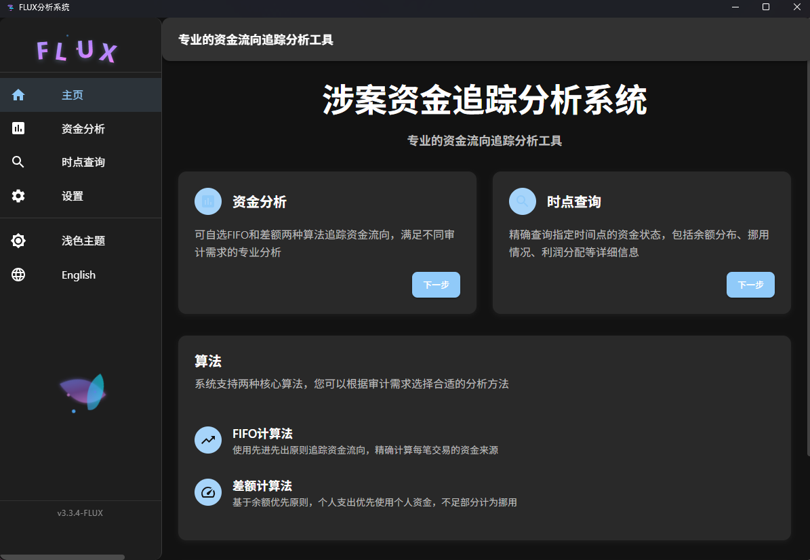</td>
<td>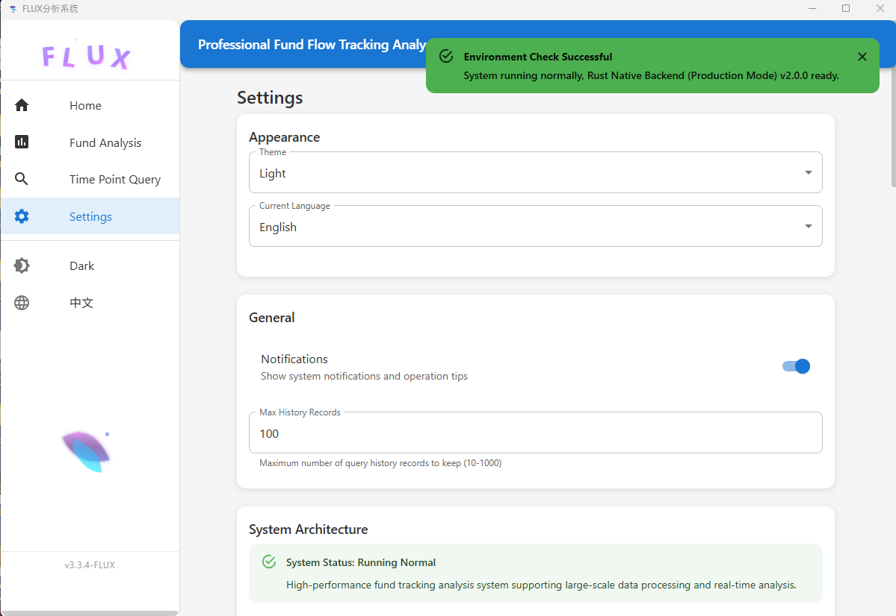</td>
</tr>
<tr>
<td align="center"><b>🌚 中文 + 暗黑主题</b></td>
<td align="center"><b>🌞 English + 明亮主题</b></td>
</tr>
</table>
</div>

### 📊 资金分析页面
**功能**: 核心审计分析功能界面

#### 文件选择与分析
- 📁 **文件选择**: 支持拖拽Excel文件到分析区域或使用窗口选择文件
- ⚙️ **算法选择**: 选择FIFO（先进先出）或差额计算法
- ▶️ **一键分析**: 点击开始按钮进行智能资金流向分析

#### 分析历史记录管理
- 📋 **历史面板**: 点击右侧小三角展开/收起分析历史记录
- 🔧 **四大快速操作**:
  - 📄 **打开分析结果**: 查看详细的逐笔分析和记录
  - 💾 **另存为**: 将输出文件保存到指定位置
  - 🏦 **场外资金池记录**: 查看每个资金池的逐笔记录和状态
  - 🗑️ **删除记录**: 清理不需要的历史记录

#### 输出文件类型
- 📊 **分析结果**: 包含逐笔资金流向分析和详细记录
- 🏛️ **场外资金池记录**: 包含每个资金池的逐笔记录和当前状态

#### 1. 文件选择界面
<div align="center">
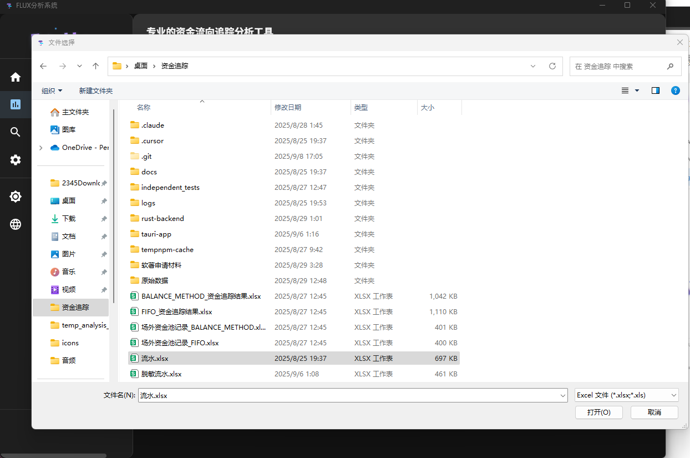
</div>

#### 2. 算法选择与开始分析
<div align="center">
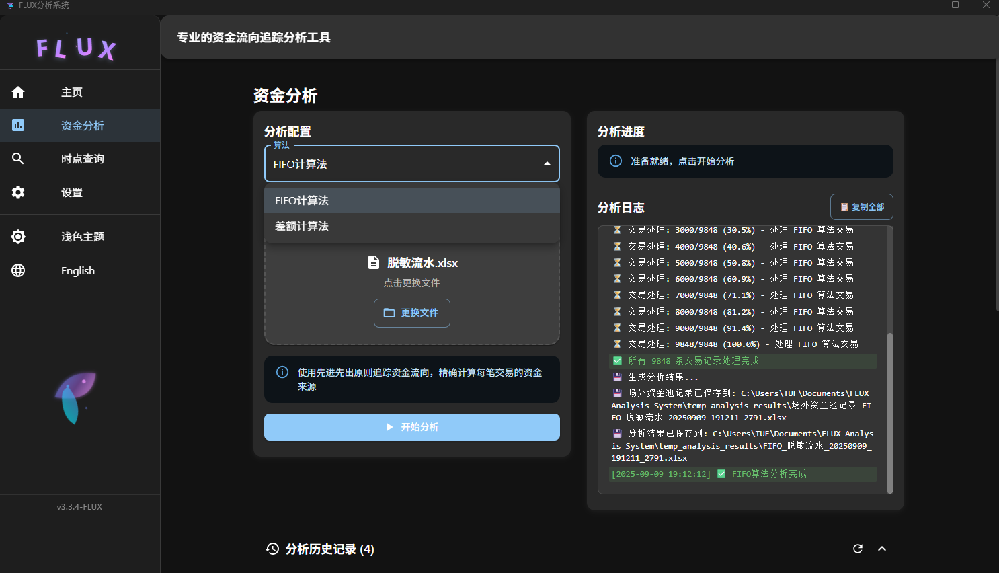
</div>

#### 3. 历史记录按钮功能介绍
<div align="center">
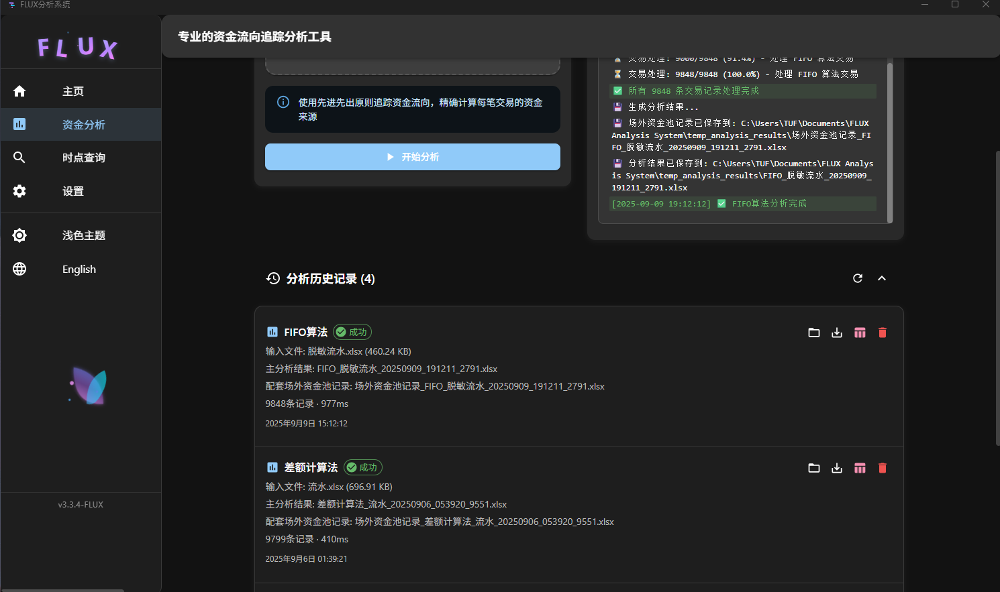
</div>

#### 4. 输出文件示例
<div align="center">
<table>
<tr>
<td>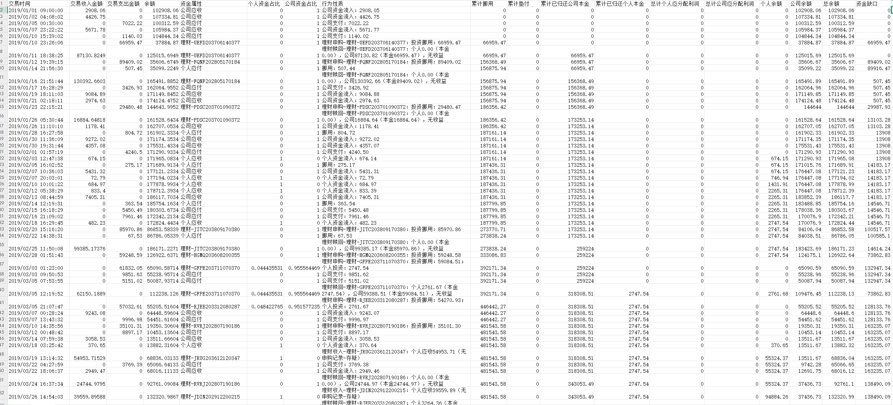</td>
<td>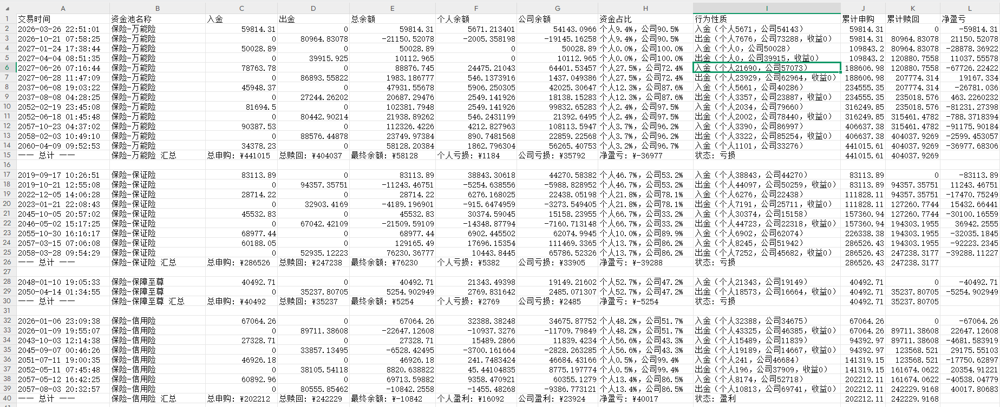</td>
</tr>
<tr>
<td align="center"><b>📊 分析结果（逐笔分析）</b></td>
<td align="center"><b>🏛️ 场外资金池记录</b></td>
</tr>
</table>
</div>

### 🔍 时点查询页面
**功能**: 精确时点财务状态查询

#### 查询操作流程
- 🎯 **行号定位**: 输入Excel流水数据的行号锁定查询时间点
  - 💡 **注意**: 需要去除标题行，实际行号 = Excel行号 - 1
  - 📅 **示例**: 查询2024年11月20日15:10:04的状态（Excel第1393行 → 输入1392）
- ⚙️ **算法选择**: 选择FIFO或差额计算法进行查询
- 🔍 **执行查询**: 点击查询按钮获取该时点的完整状态

#### 查询结果展示
- 📊 **转账属性**: 显示当前这笔转账的详细属性信息
- 💰 **余额详情**: 
  - 个人余额/公司余额的具体数值
  - 浅色字体显示各余额占总余额的占比
- 🏦 **活跃资金池**: 左侧显示截至当前时点的所有活跃资金池数量

#### 资金池详情查询
- 🔽 **资金池选择**: 选择资金池类型和子类型
- 📋 **详情查询**: 查看选定资金池截至当前时点的所有转账记录
- 📈 **占比影响**: 显示每笔转账对资金池个人/公司占比的影响
- 💹 **净盈亏分析**: 
  - 显示该资金池对主账户的盈亏状况
  - 资金池投入视为亏损，回款视为盈利

#### 查询历史管理
- 📝 **历史记录**: 下方显示查询历史，支持快速切换不同查询结果

#### 1. 行号说明（Excel行号对应关系）
<div align="center">
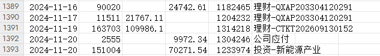
<p><i>💡 Excel第1393行对应输入1392（需去除标题行）</i></p>
</div>

#### 2. 输入行号查询界面
<div align="center">
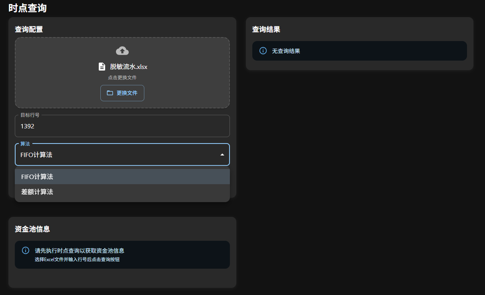
</div>

#### 3. 右侧转账属性展示
<div align="center">
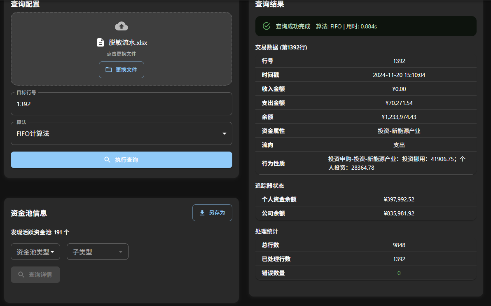
</div>

#### 4. 资金池查询操作流程
<div align="center">
<table>
<tr>
<td>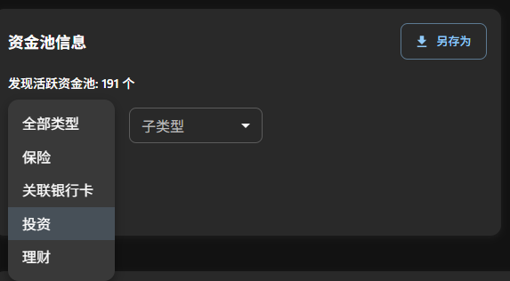</td>
<td>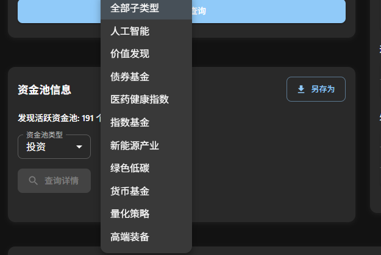</td>
<td>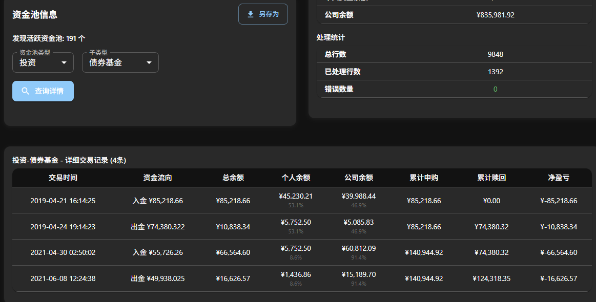</td>
</tr>
<tr>
<td align="center"><b>🔽 选择资金池类型</b></td>
<td align="center"><b>🔽 选择子类型</b></td>
<td align="center"><b>📊 查看详细信息</b></td>
</tr>
</table>
</div>

#### 5. 查询历史管理
<div align="center">
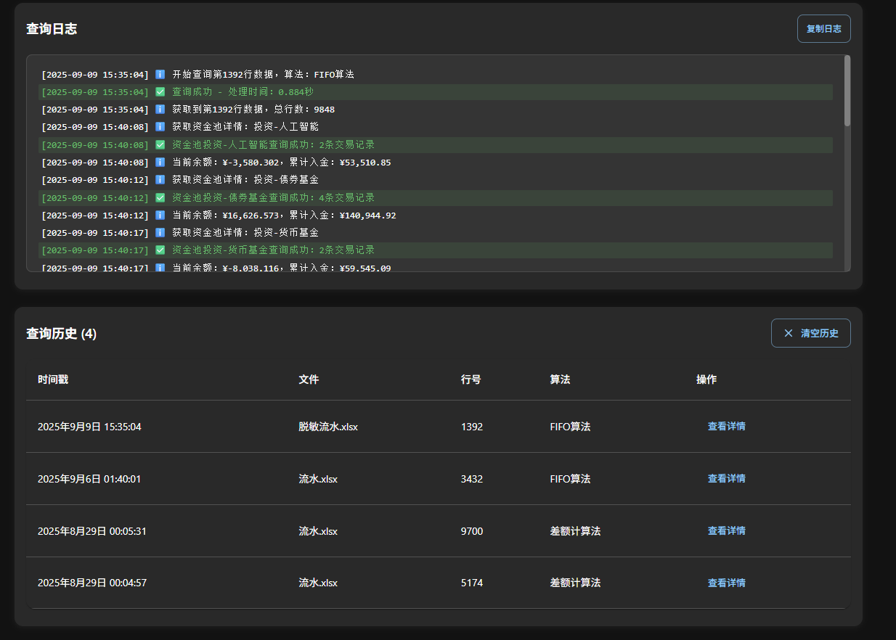
</div>

### ⚙️ 设置页面
**功能**: 系统配置与环境管理

#### 内存管理
- 📊 **最大历史记录数**: 设置系统保留的最大历史记录数量
- 💾 **存储空间控制**: 防止历史记录过多占用存储空间
- ⚡ **性能优化**: 通过限制记录数量提升系统运行效率

#### 数据管理
- 🗑️ **文件清理**: 按需清理生成的分析结果文件
- 🧹 **缓存清理**: 清理查询缓存和临时文件
- 📋 **批量操作**: 支持按时间范围或文件类型批量清理

#### 环境检查
- 🔍 **系统检测**: 检查系统环境和依赖项状态
- ⚠️ **状态报告**: 显示系统运行状态和潜在问题
- 🔧 **自动修复**: 自动检测并修复常见环境问题

#### 个性化设置
- 🌍 **语言切换**: 中文/English界面切换（也可在主页底部切换）
- 🌙 **主题模式**: 明亮主题 ↔ 暗黑主题（也可在主页底部切换）
- 📁 **路径配置**: 设置默认文件输入/输出目录

**主题切换效果**:
- 🌞 **明亮主题**: 经典白色背景，适合办公环境
- 🌚 **暗黑主题**: 护眼深色背景，适合长时间使用

#### 内存管理区域
<div align="center">
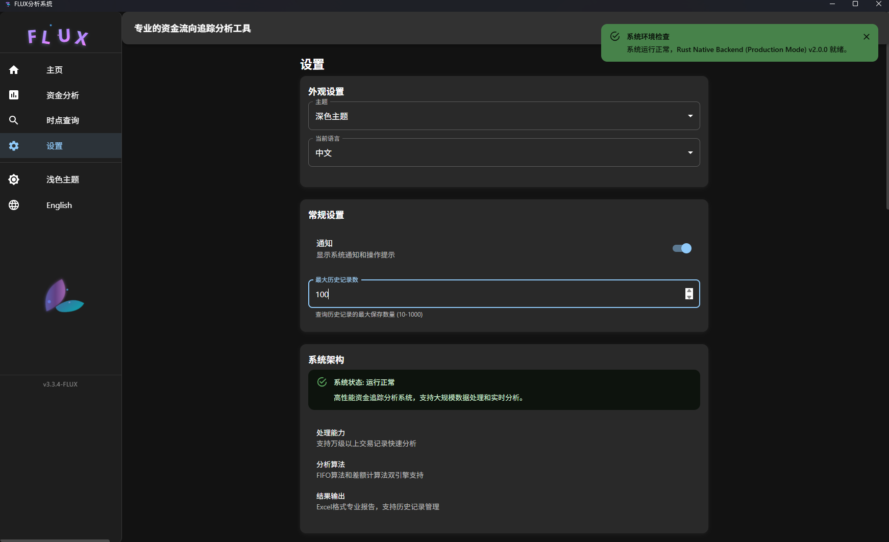
</div>

#### 数据管理区域
<div align="center">
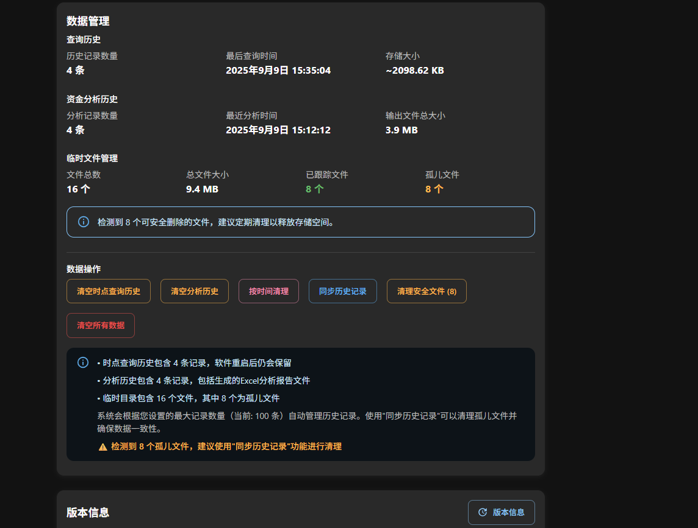
</div>

### 📋 历史记录管理 (AnalysisHistoryPanel)
**功能**: 智能分析历史管理
- 📝 **记录展示**: 显示所有历史分析记录
- 🔍 **智能检测**: 自动检测文件是否被外部删除
- 🔄 **状态同步**: 实时更新文件存在状态
- 📂 **快速操作**: 打开、另存为、删除等操作
- 🗑️ **批量清理**: 支持按时间范围批量删除记录

**文件状态管理**:
- ✅ **存在文件**: 正常显示，支持所有操作
- ❌ **已删除文件**: 横线显示，相关操作自动禁用
- 🔄 **自动刷新**: 支持手动刷新检测文件状态

<div align="center">

</div>

---

## 🌍 国际化支持

### 多语言切换
系统提供完整的中英文界面，用户可在主页底部或设置页面随时切换：

| 功能 | 中文 | English |
|------|------|---------|
| 界面语言 | 简体中文 | English |
| 错误提示 | 中文消息 | English Messages |
| 报告输出 | 中文表头 | English Headers |
| 帮助文档 | 中文说明 | English Documentation |

> 💡 **提示**: 主页导航界面已展示了中英文切换效果对比

---

## 🎨 主题系统

### 视觉主题对比

| 元素 | 明亮主题 | 暗黑主题 |
|------|----------|----------|
| 背景色 | 纯白 #FFFFFF | 深灰 #1a1a1a |
| 主色调 | 蓝色 #1976d2 | 青色 #00bcd4 |
| 文字色 | 深黑 #212121 | 浅白 #ffffff |
| 卡片色 | 浅灰 #f5f5f5 | 深灰 #2d2d2d |
| 按钮色 | 蓝色系 | 青色系 |

**切换动效**: 平滑过渡动画，提供流畅的视觉体验

<div align="center">
<table>
<tr>
<td></td>
<td></td>
</tr>
<tr>
<td align="center"><b>🌞 明亮主题</b></td>
<td align="center"><b>🌚 暗黑主题</b></td>
</tr>
</table>
</div>

---

## 📊 核心算法介绍

### 🔄 FIFO算法 (先进先出)
**原理**: 按照资金进入的时间顺序进行追踪分析
- ⚡ **适用场景**: 标准的资金流向分析
- 📈 **优势**: 逻辑清晰，易于理解和审核
- 🎯 **精度**: 适用于大多数常规审计案件

### ⚖️ 差额计算法 (Balance Method)
**原理**: 基于余额差额变化进行资金归属分析
- 🏆 **适用场景**: 复杂的资金混合情况
- 🔍 **优势**: 能处理更复杂的资金流向
- 📊 **精度**: 适用于高难度审计案件

---

## 🔧 开发和部署

### 开发环境
- **前端**: React 18 + TypeScript + Vite
- **后端**: Rust + Tauri
- **UI库**: Material-UI (MUI)
- **构建工具**: npm + Cargo

### 系统要求
- **操作系统**: Windows 10/11 (x64)
- **内存**: 最低4GB，推荐8GB+
- **存储**: 100MB可用空间
- **依赖**: 无需额外运行时

---

## 📞 支持与反馈

### 🐛 问题报告
如遇到问题，请提供以下信息：
- 系统版本和操作系统
- 详细的操作步骤
- 错误截图或日志文件
- 测试数据文件（如可提供）

### 📬 联系方式
- **GitHub Issues**: 技术问题和功能建议
- **电子邮件**: 企业用户支持
- **用户手册**: 详细操作指南

---

## 📄 许可证

本项目采用 MIT 许可证 - 详情请查看 [LICENSE](LICENSE) 文件。

---

<div align="center">

**🌟 如果这个项目对您有帮助，请给个Star支持！🌟**

Made with ❤️ by FLUX Team | Powered by Rust + Tauri

</div>